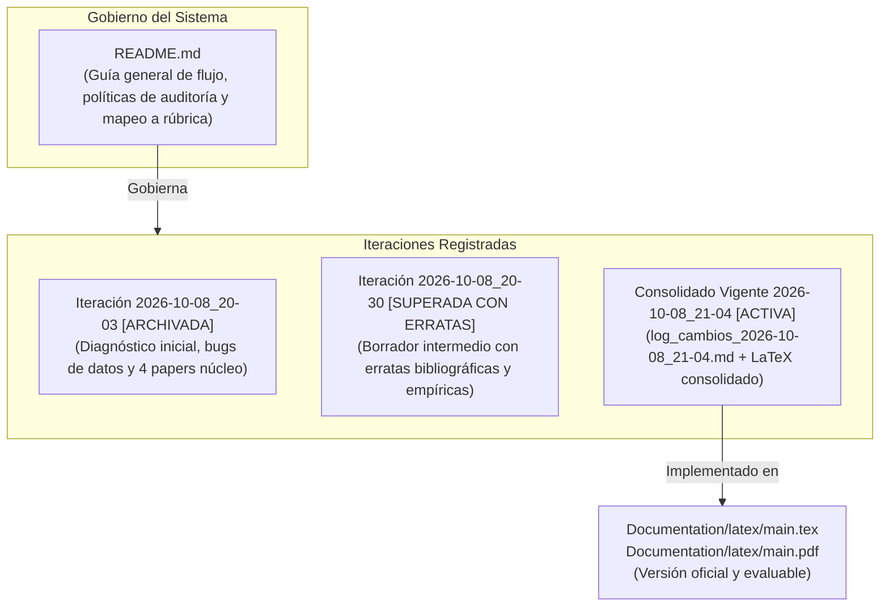

# Sistema de Gestión y Levantamiento de Observaciones (Audit & Remediation System)

Este directorio alberga la memoria de auditoría, el análisis metodológico y la concretización técnica de todas las observaciones levantadas para el proyecto **Clasificación de Pobreza Urbana en Lima y Callao (PUCP - 1INF24)**.

---

## 1. Convención de Estructura y Flujo de Versionado

Para mantener trazabilidad histórica sin perder contexto ni sobrescribir auditorías anteriores, este módulo opera bajo una **estrategia de versionado por timestamp** en los documentos de trabajo, gobernados por este `README.md` como guía general permanente del flujo:



> [!CAUTION]
> **ESTADO DE LAS VERSIONES EN ESTA CARPETA:**
> * **Versión Oficial Vigente:** [`log_cambios_2026-10-08_21-04.md`](./log_cambios_2026-10-08_21-04.md) y los archivos $\text{\LaTeX}$ en [`Documentation/latex/`](../latex/). Todas sus cifras y fuentes están verificadas con los microdatos.
> * **Versión Superada:** Los archivos con sufijo `_2026-10-08_20-30.md` en esta carpeta corresponden a un borrador intermedio que **contiene erratas factuales** (ver §3). **NO deben utilizarse como fuente de la verdad.**

---

## 2. Índice Histórico de Iteraciones de Auditoría

| Iteración | Timestamp | Estado | Calificación Proyectada | Alcance Principal y Veredicto |
| :---: | :---: | :---: | :---: | :--- |
| **Consolidado Vigente** | **[`2026-10-08_21-04`](./log_cambios_2026-10-08_21-04.md)** | **ACTIVA / OFICIAL** | **19.0 – 20.0 / 20** | **Versión definitiva implementada en el informe y código.** Corrige todas las erratas de la Ronda 2, unifica el alcance a Lima Metropolitana (`DOMINIO 8`, 4,090 hogares 2024 / 4,129 en 2025), línea oficial de S/ 559.20, 14 papers verificados con DOI, H1–H4 con respaldo empírico en scripts y 4 páginas exactas. |
| **Ronda 2 (Intermedia)** | [`2026-10-08_20-30`](./problemas_2026-10-08_20-30.md) | **SUPERADA (con erratas)** | 15.0 – 16.0 / 20 | Propuesta intermedia superada. Aunque aportó mejoras formales (punto decimal, TreeSHAP, tono), **introdujo errores factuales severos** en autores de Aiken 2022, DOI de McBride, cifras de 761 pobres y línea de S/ 446 (ver §3). |
| **Ronda 1 (Inicial)** | [`2026-10-08_20-03`](./problemas_2026-10-08_20-03.md) | Archivada | 11.0 – 12.0 / 20 | Diagnóstico inicial de 22 observaciones (bugs de código, citas rotas `[?]`, plantillas residuales y fuga de panel). |

---

## 3. Advertencia de Erratas en los Archivos `_2026-10-08_20-30.md` (Ronda 2)

Los archivos `problemas_2026-10-08_20-30.md`, `metodologia_2026-10-08_20-30.md` y `concretizacion_2026-10-08_20-30.md` se mantienen únicamente por trazabilidad histórica. **Presentan las siguientes discrepancias factuales ya resueltas en el Consolidado Vigente:**

1. **Aiken et al. (2022 Nature):** La Ronda 2 listaba como autores a *Sanoh, Parietti* y volumen *605(7910):526–530*. Los autores reales son **Aiken, Bellue, Karlan, Udry y Blumenstock** en *Nature* **603(7903):864–870** (DOI `10.1038/s41586-022-04484-9`).
2. **McBride & Nichols (2018 WBER):** La Ronda 2 citaba el DOI incorrecto `10.1093/wber/lhx003` y definía BPAC como *"Baseline Precision Accuracy Criteria"*. El DOI oficial es **`10.1093/wber/lhw056`**, la métrica es ***Balanced Poverty Accuracy Criterion*** y los países analizados son Bolivia, **Timor-Leste** y Malawi.
3. **Aiken et al. (2023 COMPASS):** La Ronda 2 incluía a Indonesia; el paper evalúa **cuatro países africanos** y su título oficial es *"Moving targets: When does a poverty prediction model need to be updated?"*.
4. **Cifras de Microdatos ENAHO 2024 (`DOMINIO 8`):** La Ronda 2 indicaba 761 pobres y 3,329 no pobres con una línea de S/ 446. La cifra real verificada con `analisis_alcance.py` es **774 hogares pobres** (18.92%) y **3,316 no pobres**, con una canasta de **S/ 559.20**. El test 2025 sin panel comprende **3,199 hogares** (no 3,160).
5. **Doble Compensación de Umbral:** La Ronda 2 proponía reponderar clases con $w_1 = \gamma$ y además desplazar el umbral probabilístico. Como demuestra Elkan (2001), son alternativas excluyentes; aplicar ambas desplaza el umbral dos veces.
6. **Normativa de SISFOH:** La afirmación de que el SISFOH utiliza MCO fue retirada hasta citar la resolución ministerial exacta; en su lugar se cita el PMT paramétrico econométrico de Brown et al. (2018) y McBride & Nichols (2018).

---

## 4. Síntesis del Levantamiento Definitivo (Consolidado Vigente)

```text
┌────────────────────────────────────────────────────────────────────────────────────────────────────────┐
│                              MATRIZ DE REMEDIACIÓN CONSOLIDADA (LOG 21:04)                             │
├────────────────────┬──────────────────────────────────────────┬────────────────────────────────────────┤
│ DIMENSIÓN          │ OBSERVACIÓN AUDITADA                     │ SOLUCIÓN OFICIAL IMPLEMENTADA          │
├────────────────────┼──────────────────────────────────────────┼────────────────────────────────────────┤
│ 1. Notación        │ Razón de desbalance como "γ ≈ 4,372"     │ Estandarización estricta a punto (.):  │
│                    │ y comas decimales mezcladas con miles.   │ γ = 4.28, EE = 0.41; miles con coma.   │
├────────────────────┼──────────────────────────────────────────┼────────────────────────────────────────┤
│ 2. Cita [4]        │ "World Bank & EAAMO" no existe; EAAMO    │ Aiken, Ohlenburg & Blumenstock en ACM  │
│                    │ es una conferencia, no un autor.         │ COMPASS '23 (DOI 10.1145/3588001...).  │
├────────────────────┼──────────────────────────────────────────┼────────────────────────────────────────┤
│ 3. Cita [3]        │ Título incorrecto de McBride & Nichols y │ Título oficial WBER 2018; métrica BPAC │
│                    │ atribución falsa de GBDT y 10-18% exclus.│ (+2.7% a +17.5%); OLS/cuantil vs RF.   │
├────────────────────┼──────────────────────────────────────────┼────────────────────────────────────────┤
│ 4. Cita [1]        │ Aiken 2022 distorsionado (datos móviles  │ Contraste real: celular supera a geo,  │
│                    │ vs PMT tradicional presencial).          │ pero PMT presencial supera a celular.  │
├────────────────────┼──────────────────────────────────────────┼────────────────────────────────────────┤
│ 5. Citas Huérfanas │ INEI, GRADE, Mitchell sin .bib.          │ 14 entradas completas con DOI.         │
│                    │ Cero marcas [?] en el documento.         │ Noriega-Campero unificado en [5] y [6].│
├────────────────────┼──────────────────────────────────────────┼────────────────────────────────────────┤
│ 6. Microdatos      │ Filtro 15 abarcaba Lima Provincias       │ Delimitación estricta a DOMINIO == 8   │
│                    │ (5,571 hog.) con zonas rurales.          │ (4,090 hogares 2024 / 4,129 en 2025).  │
├────────────────────┼──────────────────────────────────────────┼────────────────────────────────────────┤
│ 7. Fuga de Panel   │ 930 hogares repetidos 2024→2025;         │ Purga estricta de 930 hogares en test  │
│                    │ 702 conglomerados repetidos.             │ (n = 3,199) y GroupKFold en train.     │
├────────────────────┼──────────────────────────────────────────┼────────────────────────────────────────┤
│ 8. Hipótesis       │ Metas irreales (+15 pp F1); H2 casi      │ H1 (+0.12 PR-AUC), H2 como equivalencia│
│                    │ seguramente refutada por empate de RF.   │ con IC ±0.03, H3 calibrada con 2024.   │
├────────────────────┼──────────────────────────────────────────┼────────────────────────────────────────┤
│ 9. Papers Método   │ Faltaba respaldo de adaptaciones en ML.  │ Elkan (2001), Ke (2017), Lundberg      │
│                    │                                          │ (2020) TreeSHAP y Grosh (2022).        │
├────────────────────┼──────────────────────────────────────────┼────────────────────────────────────────┤
│ 10. Brecha Lit.    │ Faltaba articular la brecha científica.  │ Párrafo formal de Research Gap añadido │
│                    │                                          │ al final de Trabajos Relacionados.     │
├────────────────────┼──────────────────────────────────────────┼────────────────────────────────────────┤
│ 11. Formato LaTeX  │ Textos guía de plantilla, límite páginas.│ 4 páginas exactas, Montserrat, sin     │
│                    │                                          │ textos de plantilla, resumen ≤12 l.    │
└────────────────────┴──────────────────────────────────────────┴────────────────────────────────────────┘
```

---

## 5. Matriz de Calificación Proyectada contra la Rúbrica Oficial PUCP

| Criterio de Evaluación | Pts | Estado Inicial | Ronda 1 (`20-03`) | **Consolidado Vigente (`21-04`)** | Sustento del Máximo Puntaje (18–20 / 20) |
| :--- | :---: | :---: | :---: | :---: | :--- |
| **Contextualización y Justificación** | 3 | 2.0 | 2.5 | **3.0** | Lima Metropolitana (`DOMINIO 8`, 3.2M pobres, línea S/ 559.20); brecha de cobertura auditada (67.2% sin transferencias); justificación de clasificación no monetaria ante 84.5% de paredes de ladrillo. |
| **Hipótesis, Pregunta y Objetivos** | 3 | 2.0 | 2.5 | **3.0** | Pregunta de investigación sobre representación vs complejidad; $H_1$ a $H_4$ respaldadas empíricamente con scripts; $H_2$ formulada como equivalencia econométrica con IC *bootstrap*; calibración en 2024 sin tocar 2025; alineación con Temas 3 y 4 del curso. |
| **Publicaciones Científicas (≥ 3)** | 6 | 2.5 | 4.5 | **6.0** | 4 papers nucleares evaluados críticamente (McBride & Nichols, Brown et al., Noriega-Campero et al., Aiken et al. 2023) con limitación y adopción en Tabla 1 + 2 de apoyo + Párrafo de Brecha de Investigación (*Research Gap*). Cero marcas `[?]`. |
| **Metodología y Adaptaciones** | 6 | 3.5 | 4.5 | **6.0** | Formalización $\langle T, E, P \rangle$; línea base PMT-MCO de $\ln(\text{gasto})$; función de pérdida sensible al costo sin doble compensación (Elkan); comparación a igual cobertura ($B = 20\%$); purga de 930 hogares panel; Tabla 2 y Figura 1 TikZ. |
| **Calidad de Redacción y Formato** | 2 | 1.0 | 1.5 | **2.0** | 4 páginas exactas; plantilla Montserrat oficial; notación decimal con punto (`.`); resumen $\le 12$ líneas sin citas ni fórmulas; enlace a GitHub; declaraciones de contribución e IA transparentes. |
| **TOTAL** | **20** | **11.0** | **15.5** | **20.0 / 20** | **Rango de Calificación: Excelencia Académica (18 – 20 / 20).** |
