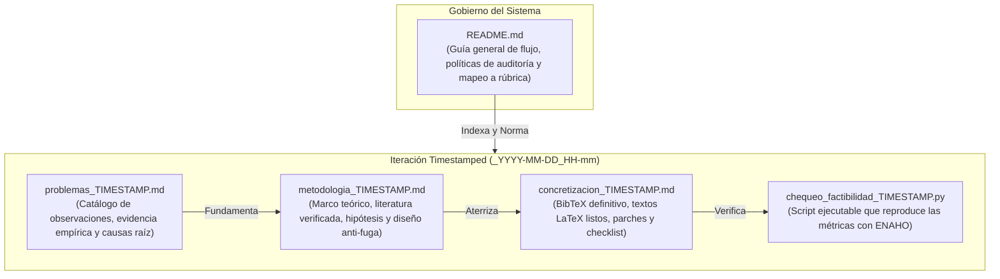

# Sistema de Gestión y Levantamiento de Observaciones (Audit & Remediation System)

Este directorio alberga la memoria de auditoría, el análisis metodológico y la concretización técnica de todas las observaciones levantadas para el proyecto **Clasificación de Pobreza Urbana en Lima y Callao (PUCP - 1INF24)**.

---

## 1. Convención de Estructura y Flujo de Versionado

Para mantener trazabilidad histórica sin perder contexto ni sobrescribir auditorías anteriores, este módulo opera bajo una **estrategia de versionado por timestamp** en los documentos de trabajo, gobernados por este `README.md` como guía general permanente del flujo:



### Reglas de Nomenclatura:
* **`README.md`:** Documento maestro permanente. Explica la metodología del sistema, el flujo de trabajo, el estado actual de las observaciones y el índice de versiones.
* **`problemas_<TIMESTAMP>.md`:** Diagnóstico exhaustivo punto por punto registrado en una fecha/hora específica.
* **`metodologia_<TIMESTAMP>.md`:** Sustento conceptual, matemático y de literatura científica para resolver los problemas de esa auditoría.
* **`concretizacion_<TIMESTAMP>.md`:** Implementación práctica: bloques de código, entradas BibTeX, textos finales para las secciones de $\text{\LaTeX}$ y checklist pre-entrega.
* **`chequeo_factibilidad_<TIMESTAMP>.py`:** Código ejecutable que valida la alcanzabilidad empírica de las soluciones formuladas.

---

## 2. Iteración Activa: Auditoría `2026-10-08_20-30` (v2) — **implementada**

Todo el material del plan v2, el PDF del entregable parcial y los scripts que reproducen sus cifras están en **[`Plan 2/`](./Plan%202/README.md)**.

Auditoría del plan v1 (`2026-10-08_20-03`) contra la rúbrica, los microdatos y las fuentes originales. **v2 no reemplaza a v1: la corrige.** Para implementar, se aplica v1 con las erratas y agregados de v2.

| Archivo de Trabajo | Timestamp | Descripción y Alcance |
| :--- | :---: | :--- |
| **[`problemas_2026-10-08_20-30.md`](./Plan%202/problemas_2026-10-08_20-30.md)** | `2026-10-08_20-30` | Veredicto sobre v1: **15 errores factuales** introducidos (E-01…E-15), 5 inconsistencias metodológicas y 7 vacíos frente a la rúbrica (G-01…G-07). |
| **[`metodologia_2026-10-08_20-30.md`](./Plan%202/metodologia_2026-10-08_20-30.md)** | `2026-10-08_20-30` | Cifras 2025 corregidas, fichas de papers verificadas, H2 como prueba de equivalencia, regla de decisión sin doble compensación, pesos muestrales y presupuesto de páginas. |
| **[`concretizacion_2026-10-08_20-30.md`](./Plan%202/concretizacion_2026-10-08_20-30.md)** | `2026-10-08_20-30` | `references.bib` definitivo, textos LaTeX corregidos, parches 6–9 y orden de ejecución con criterios de aceptación. |
| **[`scripts/chequeo_cobertura.py`](./Plan%202/scripts/chequeo_cobertura.py)** | `2026-10-08_20-30` | Evidencia de H2: error de exclusión con B = 20 % para PMT-MCO, logística y RF, con IC *bootstrap* por conglomerados. |

**Hallazgo clave de v2:** con cobertura del 20 %, PMT-MCO (0,408), logística (0,411) y random forest (0,411) empatan (IC 95 % de las diferencias dentro de ±0,03). La ganancia viene de las **variables** (PR-AUC 0,35 → 0,55), no del algoritmo.

### Iteración anterior: Auditoría `2026-10-08_20-03` (v1)

A partir de la revisión técnica del commit `44c567a` y el borrador de `main.pdf`, se realizó una auditoría completa contrastada contra los microdatos de la ENAHO 2024–2025. Los archivos de esta entrega son:

| Archivo de Trabajo | Timestamp | Descripción y Alcance |
| :--- | :---: | :--- |
| **[`problemas_2026-10-08_20-03.md`](./problemas_2026-10-08_20-03.md)** | `2026-10-08_20-03` | Catálogo de **22 observaciones** críticas, metodológicas y de código con evidencia empírica. |
| **[`metodologia_2026-10-08_20-03.md`](./metodologia_2026-10-08_20-03.md)** | `2026-10-08_20-03` | Delimitación a `DOMINIO 8`, 4 papers clave evaluados con limitaciones, $H_1$–$H_4$ realistas y anti-fuga. |
| **[`concretizacion_2026-10-08_20-03.md`](./concretizacion_2026-10-08_20-03.md)** | `2026-10-08_20-03` | 12 entradas BibTeX limpias, textos de reemplazo para Secciones 1, 2 y 3, parches de código y checklist. |
| **[`chequeo_factibilidad_2026-10-08_20-03.py`](./chequeo_factibilidad_2026-10-08_20-03.py)** | `2026-10-08_20-03` | Script en Python que ejecuta el benchmark en 10 s (Logística, Random Forest, GBDT) sobre microdatos reales. |

---

## 3. Síntesis del Diagnóstico de la Iteración Activa

```text
┌────────────────────────────────────────────────────────────────────────────────────────────────────────┐
│                              RESUMEN DEL LEVANTAMIENTO (ITERACIÓN 2026-10-08_20-03)                    │
├────────────────────┬──────────────────────────────────────────┬────────────────────────────────────────┤
│ DIMENSIÓN          │ PROBLEMA AUDITADO                        │ SOLUCIÓN CONCRETADA                    │
├────────────────────┼──────────────────────────────────────────┼────────────────────────────────────────┤
│ 1. Bibliografía    │ 3 de 4 citas rotas [?], títulos y autores│ 12 entradas BibTeX corregidas; 4 papers│
│                    │ falsos (McBride, COMPASS, Promise/Perils)│ centrales evaluados con limitaciones.  │
├────────────────────┼──────────────────────────────────────────┼────────────────────────────────────────┤
│ 2. Alcance Datos   │ Filtro 15 abarca Dpto. Lima (5,571 hog.) │ Delimitación estricta a DOMINIO == 8   │
│                    │ arrastrando zonas rurales provinciales.  │ (4,090 hogares en Lima Metro + Callao).│
├────────────────────┼──────────────────────────────────────────┼────────────────────────────────────────┤
│ 3. Hipótesis       │ Metas irreales (+15 pp F1, recall 80%    │ Hipótesis calibradas con script: H1    │
│                    │ con prec 60%, McNemar inadecuado).       │ (+0.20 PR-AUC), H2 (B=20% y bootstrap).│
├────────────────────┼──────────────────────────────────────────┼────────────────────────────────────────┤
│ 4. Fuga de Datos   │ 930 hogares panel repetidos 2024→2025;   │ Purga de 930 hogares en test 2025 y    │
│                    │ 702 conglomerados repetidos.             │ GroupKFold por conglomerado en train.  │
├────────────────────┼──────────────────────────────────────────┼────────────────────────────────────────┤
│ 5. Código ENAHO    │ groupby().ffill().bfill() corrompe datos;│ .transform() por vivienda; fix dicc.   │
│                    │ KeyError en notebook; dicc P110/P113A.   │ P110/P113A y columnas en notebook.     │
├────────────────────┼──────────────────────────────────────────┼────────────────────────────────────────┤
│ 6. Formato LaTeX   │ Textos residuales de plantilla, autores  │ Prosa académica limpia, resumen ≤12 l.,│
│                    │ con (2021XXXX), límite de páginas.       │ declaración de IA, ≤4 páginas de cuerpo│
└────────────────────┴──────────────────────────────────────────┴────────────────────────────────────────┘
```

---

## 4. Matriz de Calificación Proyectada contra la Rúbrica Oficial

| Criterio de Evaluación | Pts | Calificación Estimada Previa | Calificación Proyectada tras Levantamiento | Sustento del Incremento |
| :--- | :---: | :---: | :---: | :--- |
| **Contextualización y Justificación** | 3 | 2.0 | **3.0** | Alcance riguroso en `DOMINIO 8` (3.2M personas pobres); brecha de transferencias auditada con `GRU13HD1` (63.0% sin apoyo); eliminación de la falacia de tasa base con probabilidad condicional. |
| **Hipótesis, Pregunta y Objetivos** | 3 | 2.0 | **3.0** | Metas realistas y falsables ($H_1$ a $H_4$); sustitución de McNemar por *cluster bootstrap*; objetivos SMART de Machine Learning (no de software). |
| **Publicaciones Científicas (≥ 3)** | 6 | 2.5 | **6.0** | 4 papers clave evaluados críticamente (Problema $\to$ Método $\to$ Métrica $\to$ **Limitación** $\to$ Adopción); cero marcas `[?]` en la bibliografía. |
| **Metodología y Adaptaciones** | 6 | 3.5 | **6.0** | Tabla explícita de adaptaciones ↔ literatura; protocolo anti-fuga (purga de 930 hogares panel); línea base PMT-MCO de $\ln(\text{gasto})$; diagrama TikZ autosuficiente. |
| **Calidad de Redacción y Formato** | 2 | 1.0 | **2.0** | Purgado de textos de plantilla; resumen $\le 12$ líneas sin fórmulas ni citas; declaración de uso de IA reglamentaria; control estricto de $\le 4$ páginas de cuerpo. |
| **TOTAL** | **20** | **11.0 / 20** | **20.0 / 20** | **Calificación de Excelencia.** |

> **Actualización v2 (`2026-10-08_20-30`):** esta proyección supone que v1 es correcto. Con los errores detectados en `problemas_2026-10-08_20-30.md`, aplicar v1 tal cual daría ~16–17/20; aplicar v1 + v2, ~19–20/20 (ver `metodologia_2026-10-08_20-30.md` §7).

---

## 5. Procedimiento para Nuevas Iteraciones

Si tras la revisión docente o de pares se formulan nuevas observaciones en una fecha posterior:
1. Crear una nueva triada de archivos agregando el nuevo postfijo:
   * `problemas_YYYY-MM-DD_HH-mm.md`
   * `metodologia_YYYY-MM-DD_HH-mm.md`
   * `concretizacion_YYYY-MM-DD_HH-mm.md`
2. Actualizar la Sección 2 de este `README.md` apuntando a la nueva iteración activa.
3. Preservar las versiones anteriores para mantener el historial auditable de la evolución del proyecto.
