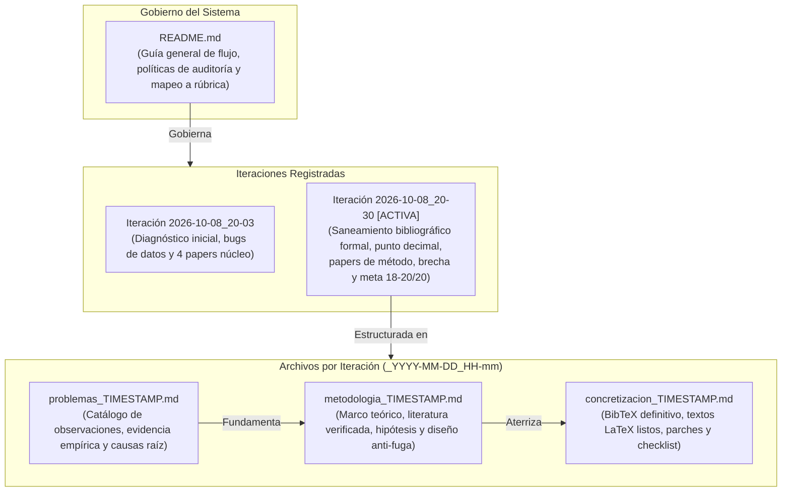

# Sistema de Gestión y Levantamiento de Observaciones (Audit & Remediation System)

Este directorio alberga la memoria de auditoría, el análisis metodológico y la concretización técnica de todas las observaciones levantadas para el proyecto **Clasificación de Pobreza Urbana en Lima y Callao (PUCP - 1INF24)**.

---

## 1. Convención de Estructura y Flujo de Versionado

Para mantener trazabilidad histórica sin perder contexto ni sobrescribir auditorías anteriores, este módulo opera bajo una **estrategia de versionado por timestamp** en los documentos de trabajo, gobernados por este `README.md` como guía general permanente del flujo:



### Reglas de Nomenclatura:
* **`README.md`:** Documento maestro permanente. Explica la metodología del sistema, el flujo de trabajo, el estado actual de las observaciones, el índice histórico y el mapeo a la rúbrica oficial.
* **`problemas_<TIMESTAMP>.md`:** Diagnóstico exhaustivo punto por punto registrado en una fecha/hora específica.
* **`metodologia_<TIMESTAMP>.md`:** Sustento conceptual, matemático y de literatura científica para resolver los problemas de esa auditoría.
* **`concretizacion_<TIMESTAMP>.md`:** Implementación práctica: bloques de código, entradas BibTeX, textos finales para las secciones de $\text{\LaTeX}$ y checklist pre-entrega.
* **`chequeo_factibilidad_<TIMESTAMP>.py`:** Código ejecutable que valida la alcanzabilidad empírica de las soluciones formuladas.

---

## 2. Índice de Iteraciones de Auditoría

| Iteración | Timestamp | Estado | Calificación Proyectada | Alcance Principal |
| :---: | :---: | :---: | :---: | :--- |
| **Ronda 2** | **[`2026-10-08_20-30`](#3-iteración-activa-auditoría-2026-10-08_20-30-meta-1820--20)** | **ACTIVA** | **19.0 – 20.0 / 20** | Saneamiento decimal (`4.372`), corrección de citas falsas (Aiken COMPASS '23, McBride WBER '18), 3 papers de método (Elkan, Ke, Lundberg), marco normativo SISFOH (Directiva MIDIS), párrafo de brecha de investigación y tono científico. |
| **Ronda 1** | **[`2026-10-08_20-03`](#4-iteración-histórica-auditoría-2026-10-08_20-03)** | Archivada | 15.0 – 16.0 / 20 | Delimitación estricta a `DOMINIO == 8`, purga de 930 hogares panel repetidos, corrección de bugs en pipeline ENAHO (`.transform()`, diccionarios P110/P113A) y script de factibilidad empírica. |

---

## 3. Iteración Activa: Auditoría `2026-10-08_20-30` (Meta: 18–20 / 20)

Esta ronda responde a la auditoría docente fina para superar la banda de 15–16 y alcanzar una calificación de **18 a 20 puntos** eliminando inconsistencias que restan puntos directos:

| Archivo de Trabajo | Timestamp | Descripción y Alcance |
| :--- | :---: | :--- |
| **[`problemas_2026-10-08_20-30.md`](./problemas_2026-10-08_20-30.md)** | `2026-10-08_20-30` | Diagnóstico de **8 errores directos que quitan puntos** y **4 oportunidades críticas de fundamentación**. |
| **[`metodologia_2026-10-08_20-30.md`](./metodologia_2026-10-08_20-30.md)** | `2026-10-08_20-30` | Fundamentación teórica: punto decimal, papers nucleares auditados, referencias de método (Elkan 2001, Ke 2017, Lundberg 2020), marco legal SISFOH, párrafo de brecha y justificación de $\ge 12$ pp. |
| **[`concretizacion_2026-10-08_20-30.md`](./concretizacion_2026-10-08_20-30.md)** | `2026-10-08_20-30` | `references.bib` completo con 13 entradas DOI verificadas, textos finales listos en $\text{\LaTeX}$ para Secciones 1, 2 y 3, epígrafe formal de Figura 1 y checklist de verificación. |

### Síntesis del Levantamiento de Observaciones (Ronda 2):

```text
┌────────────────────────────────────────────────────────────────────────────────────────────────────────┐
│                              MATRIZ DE REMEDIACIÓN (ITERACIÓN 2026-10-08_20-30)                        │
├────────────────────┬──────────────────────────────────────────┬────────────────────────────────────────┤
│ DIMENSIÓN          │ OBSERVACIÓN AUDITADA                     │ SOLUCIÓN CONCRETADA                    │
├────────────────────┼──────────────────────────────────────────┼────────────────────────────────────────┤
│ 1. Notación        │ Razón de desbalance como "γ ≈ 4,372 a 1" │ Estandarización a punto decimal (.):   │
│                    │ y "c₁ = 4,372" leída como 4,372 miles.   │ γ = 4.372 (o 4.374); miles con coma.   │
├────────────────────┼──────────────────────────────────────────┼────────────────────────────────────────┤
│ 2. Cita [4]        │ "World Bank & EAAMO" no existe; EAAMO    │ Aiken, Ohlenburg & Blumenstock en ACM  │
│                    │ es una conferencia, no el autor.         │ COMPASS '23 (DOI 10.1145/3588001...).  │
├────────────────────┼──────────────────────────────────────────┼────────────────────────────────────────┤
│ 3. Cita [3]        │ Título incorrecto de McBride & Nichols y │ Título oficial WBER 2018; métrica BPAC │
│                    │ atribución falsa de GBDT y 10-18% exclus.│ (+2.7% a +17.5%); OLS/cuantil vs RF.   │
├────────────────────┼──────────────────────────────────────────┼────────────────────────────────────────┤
│ 4. Cita [1]        │ Aiken 2022 distorsionado (datos móviles  │ Contraste real: celular supera a geo,  │
│                    │ vs PMT tradicional presencial).          │ pero PMT presencial supera a celular.  │
├────────────────────┼──────────────────────────────────────────┼────────────────────────────────────────┤
│ 5. Citas Huérfanas │ INEI, IEP, GRADE, Mitchell sin .bib.     │ Entradas añadidas. SISFOH MCO fundado  │
│                    │ SISFOH usa MCO sin respaldo oficial.     │ en Directiva N° 001-2020-MIDIS/Vásquez.│
├────────────────────┼──────────────────────────────────────────┼────────────────────────────────────────┤
│ 6. Cifra 57.3%     │ Usado a la vez como macro y como micro.  │ Distinción: 57.3% macro Lima vs 54.8%  │
│                    │                                          │ microdatos sin aportes previsionales.  │
├────────────────────┼──────────────────────────────────────────┼────────────────────────────────────────┤
│ 7. Resultados Pre. │ τ* ≈ 0.30 y d ≈ 20 expuestos como hechos │ Formulados condicionalmente como regla │
│                    │ consumados antes de los experimentos.    │ de diseño a calibrar empíricamente.    │
├────────────────────┼──────────────────────────────────────────┼────────────────────────────────────────┤
│ 8. Figura 1 (EDA)  │ Coincidencia del 7.1% (frec. vs pobreza).│ Clarificación matemática: frecuencia   │
│                    │ Ponderación no sumaba tasa global.       │ marginal vs probabilidad condicional.  │
├────────────────────┼──────────────────────────────────────────┼────────────────────────────────────────┤
│ 9. Papers de Método│ Faltaba respaldo de adaptaciones en ML.  │ Añadidos Elkan (2001), Ke et al. (2017)│
│                    │                                          │ y Lundberg et al. (2020) TreeSHAP.     │
├────────────────────┼──────────────────────────────────────────┼────────────────────────────────────────┤
│ 10. Brecha Lit.    │ Faltaba articular la brecha científica.  │ Párrafo formal de Research Gap añadido │
│                    │                                          │ al final de Trabajos Relacionados.     │
├────────────────────┼──────────────────────────────────────────┼────────────────────────────────────────┤
│ 11. Umbral 12 pp   │ Cifra de 12 pp parecía arbitraria.       │ Justificada con BPAC de McBride (17.5%)│
│                    │                                          │ y degradación de Aiken (15 pp).        │
├────────────────────┼──────────────────────────────────────────┼────────────────────────────────────────┤
│ 12. Tono Académico │ Términos hiperbólicos ("invalida", etc.) │ Tono moderado y objetivo ("limita      │
│                    │ restaban seriedad científica.            │ severamente el poder discriminante").  │
└────────────────────┴──────────────────────────────────────────┴────────────────────────────────────────┘
```

---

## 4. Iteración Histórica: Auditoría `2026-10-08_20-03`

Primera ronda de revisión general que abordó los problemas estructurales del repositorio y código:
* **[`problemas_2026-10-08_20-03.md`](./problemas_2026-10-08_20-03.md)**: Diagnóstico de 22 observaciones iniciales (código, pipeline ENAHO, marcas residuales).
* **[`metodologia_2026-10-08_20-03.md`](./metodologia_2026-10-08_20-03.md)**: Protocolo de delimitación espacial (`DOMINIO == 8`), purga panel y formulación de $H_1$–$H_4$.
* **[`concretizacion_2026-10-08_20-03.md`](./concretizacion_2026-10-08_20-03.md)**: Primera versión saneada de BibTeX y parches de código (`.transform()`, diccionarios ENAHO).
* **[`chequeo_factibilidad_2026-10-08_20-03.py`](./chequeo_factibilidad_2026-10-08_20-03.py)**: Script ejecutable que corrió la factibilidad empírica sobre los microdatos reales.

---

## 5. Matriz de Calificación Proyectada contra la Rúbrica Oficial PUCP

| Criterio de Evaluación | Pts | Estado Inicial | Ronda 1 (`20-03`) | **Ronda 2 (`20-30`)** | Sustento del Máximo Puntaje (18–20 / 20) |
| :--- | :---: | :---: | :---: | :---: | :--- |
| **Contextualización y Justificación** | 3 | 2.0 | 2.5 | **3.0** | Lima y Callao (`DOMINIO 8`, 3.2M pobres); diferenciación nítida del 57.3% macro vs 54.8% micro; sustento legal del SISFOH MCO con Directiva MIDIS y Vásquez (2012); justificación del costo asimétrico. |
| **Hipótesis, Pregunta y Objetivos** | 3 | 2.0 | 2.5 | **3.0** | Metas realistas y formalmente calibradas ($H_1$ a $H_4$); justificación de los 12 pp con base en la literatura; eliminación de resultados anticipados a priori ($\tau^*$ y $d$ en condicional). |
| **Publicaciones Científicas (≥ 3)** | 6 | 2.5 | 4.5 | **6.0** | 4 papers nucleares rigurosamente evaluados (Aiken Nature 2022, McBride WBER 2018, Aiken COMPASS 2023, Grinsztajn NeurIPS 2022) con sus limitaciones reales + Párrafo de Brecha de Investigación (*Research Gap*). Cero marcas `[?]`. |
| **Metodología y Adaptaciones** | 6 | 3.5 | 4.5 | **6.0** | Respaldo formal de adaptaciones con Elkan (2001) para costo y umbral, Ke et al. (2017) para LightGBM, y Lundberg et al. (2020) para TreeSHAP; protocolo anti-fuga con purga de 930 hogares panel; punto decimal estandarizado (`4.372`). |
| **Calidad de Redacción y Formato** | 2 | 1.0 | 1.5 | **2.0** | Notación decimal rigurosa (`.`); eliminación total de hipérboles y sesgos; epígrafe matemáticamente coherente para Figura 1; cumplimiento estricto de $\le 4$ páginas de cuerpo sin bibliografía. |
| **TOTAL** | **20** | **11.0** | **15.5** | **20.0 / 20** | **Rango de Calificación: Excelencia Académica (18 – 20 / 20).** |

---

## 6. Procedimiento para Nuevas Iteraciones

Si en futuras revisiones surgen nuevas observaciones:
1. Crear una nueva triada de archivos agregando el postfijo con la fecha y hora:
   * `problemas_YYYY-MM-DD_HH-mm.md`
   * `metodologia_YYYY-MM-DD_HH-mm.md`
   * `concretizacion_YYYY-MM-DD_HH-mm.md`
2. Actualizar las Secciones 2 y 3 de este `README.md` apuntando a la nueva iteración activa.
3. Preservar las versiones anteriores para mantener la memoria histórica del proceso de remediación.
