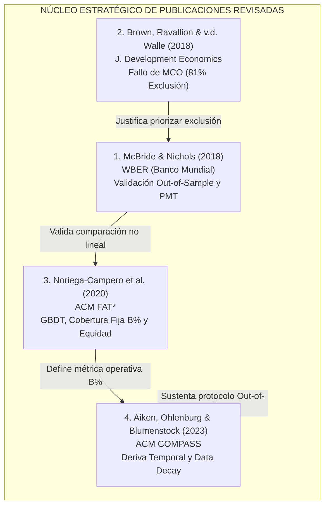
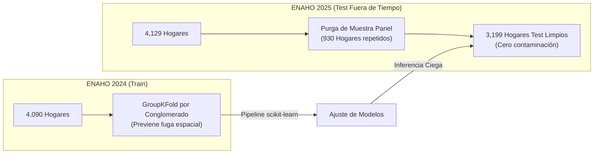

# Marco Metodológico y Conceptual de Levantamiento

**Fecha y Hora de Registro:** 08 de Octubre de 2026, 20:03:11 -05:00  
**Documento Complementario:** [`problemas_2026-10-08_20-03.md`](./problemas_2026-10-08_20-03.md) y [`concretizacion_2026-10-08_20-03.md`](./concretizacion_2026-10-08_20-03.md)

Este documento establece la formulación teórica, epistemológica y matemática para subsanar íntegramente las observaciones detectadas en el informe académico, garantizando el cumplimiento riguroso de la rúbrica oficial del curso **Inteligencia Artificial (PUCP - 1INF24)**.

---

## 1. Delimitación Geográfica y Muestral Oficial

### 1.1 Adopción de Lima Metropolitana y Callao (`DOMINIO == 8`)
Para garantizar coherencia entre el texto del informe, el código de ingestión y la estadística oficial del INEI, se abandona el filtro genérico por departamento (`UBIGEO 15`) y se adopta formalmente el dominio estadístico:

$$\mathcal{D}_{\text{geo}} = \{ i \in \text{ENAHO} \mid \text{DOMINIO}_i = 8 \}$$

Equivalentemente, en la codificación de ubigeos distritales de 6 dígitos:
$$\text{UBIGEO}_i \in \{\text{0701xx}\} \cup \{\text{1501xx}\}$$
donde `0701` corresponde a los 7 distritos de la Provincia Constitucional del Callao y `1501` a los 43 distritos de la Provincia de Lima.

### 1.2 Dimensionamiento Muestral y Factores de Expansión
Al depurar los 1,481 hogares de Lima Provincias (zonas rurales y agrícolas de Yauyos, Canta, Oyón, etc., que pertenecen a los dominios Costa Centro y Sierra Centro con canastas de S/ 336 a S/ 453), la muestra urbana metropolitana queda rigurosamente establecida:

```text
┌────────────────────────────────────────────────────────────────────────────────────────┐
│                        BALANCE MUESTRAL OFICIAL (DOMINIO == 8)                         │
├────────────────────┬─────────────────────────────┬─────────────────────────────────────┤
│ PARÁMETRO          │ ENAHO 2024 (Entrenamiento)  │ ENAHO 2025 (Prueba Fuera de Tiempo) │
├────────────────────┼─────────────────────────────┼─────────────────────────────────────┤
│ Hogares Totales    │ N = 4,090 hogares           │ N = 4,129 hogares                   │
│ Hogares Panel      │ 930 hogares recurrentes     │ 930 hogares (a purgar de prueba)    │
│ Muestra Limpia Test│ —                           │ N_test = 3,199 hogares sin panel    │
│ Hogares Pobres (y=1│ 774 hogares (18.92% muestral│ 719 hogares (17.41% muestral)       │
│ Razón de Desbalance│ γ = 3,316 / 774 ≈ 4.284 : 1 │ γ = 3,410 / 719 ≈ 4.743 : 1         │
│ Pobreza Expandida  │ 28.21% de personas          │ 26.5% estimado                      │
│ Población Afectada │ ~3.2 millones de habitantes │ ~3.0 millones de habitantes         │
│ Línea de Pobreza   │ S/ 559.20 mensual / persona │ S/ 568.00 mensual / persona         │
└────────────────────┴─────────────────────────────┴─────────────────────────────────────┘
```

* **Validación de Expansión:** Multiplicando el factor de expansión de hogares por el número de residentes (`FACTOR07 * MIEPERHO`), la muestra de 2024 reproduce con exactitud la cifra macroeconómica publicada por el INEI: **28.21% de pobreza monetaria** sobre una población estimada de 11.4 millones de personas en Lima Metropolitana y Callao (**3.2 millones de personas en vulnerabilidad**).

---

## 2. Redefinición del Problema Social y Brecha de Cobertura

### 2.1 Sustitución de la Matriz `INGTPUHD` por la Brecha de Cobertura Integral
Se corrige la caracterización del problema social evitando la falacia de atribuir la falta de transferencias a un error de cálculo del SISFOH. Se define formalmente la **Brecha de Cobertura de la Protección Social**:

$$B_{\text{social}} = \frac{\sum_{i \in \text{Pobres}} \mathbb{I}(\text{INGTPUHD}_i = 0 \;\land\; \text{GRU13HD1}_i = 0)}{\sum_{i \in \text{Pobres}} 1}$$

* **Evidencia Empírica Integrada:** En la muestra de Lima Metropolitana (`DOMINIO == 8`), al cruzar transferencias monetarias (`INGTPUHD`) y programas públicos de asistencia alimentaria (`GRU13HD1`), el **63.0% de los hogares en pobreza no recibe ningún tipo de ayuda estatal** (66.7% ponderado poblacionalmente).
* **Justificación de la Clasificación Supervisada:** La inobservabilidad del ingreso en el sector informal (57.3% de la fuerza laboral metropolitana) impide a los padrones administrativos tradicionales alcanzar a esta población. Un sistema supervisado sobre proxies observables del hábitat y capital humano permite al Estado realizar búsqueda activa e identificación proactiva sin exigir planillas salariales.

### 2.2 Desactivación de la Falacia de Tasa Base
Se sustituye la afirmación de que "el 59.4% de los pobres vive en ladrillo" por la demostración probabilística condicional:
$$P(\text{Pobre} \mid \text{Paredes = Madera/Estera}) = 35.0\% \quad \text{vs} \quad P(\text{Pobre} \mid \text{Paredes = Ladrillo}) = 14.5\%$$
El tipo de material es una condición necesaria pero insuficiente. Se demuestra empíricamente que un modelo entrenado únicamente con variables de vivienda alcanza una $\text{PR-AUC} = 0.345$, mientras que la integración multidimensional (demografía, educación y ocupación informal) eleva la $\text{PR-AUC}$ a **0.548** (+0.203 puntos).

---

## 3. El Nuevo Núcleo de Publicaciones Científicas (Evaluación Crítica)

Para responder rigurosamente al criterio de evaluación de la rúbrica (6 puntos), se formula el núcleo de cuatro publicaciones primarias, detallando su problema, datos, metodología, métrica cuantitativa, limitación teórica y adopción en nuestro diseño:



### 3.1 McBride & Nichols (2018) — *The World Bank Economic Review*
* **Título:** *Retooling poverty targeting using out-of-sample validation and machine learning*.
* **Problema Abordado:** Las fórmulas convencionales de Proxy Means Testing (PMT) son ajustadas mediante regresión lineal estándar por MCO dentro de muestra (*in-sample*), generando sobreajuste y degradación severa al desplegarse en poblaciones no observadas.
* **Datos y Modelos:** Microdatos de encuestas de hogares en Bolivia, Malawi y Ghana. Comparan MCO tradicional, regresión cuantílica por validación cruzada y ensambles de árboles (Random Forest y Quantile Regression Forest).
* **Resultado Cuantitativo:** La validación fuera de muestra optimiza la precisión de pobreza (BPAC) entre un 2.7% (Malawi) y un 17.5% (Bolivia). Crucialmente, **el modelo lineal paramétrico seleccionado por validación cruzada compite de igual a igual con los ensambles no lineales**.
* **Limitación:** El estudio fue desarrollado en contextos predominantemente rurales de África subsahariana y los Andes bolivianos; no evalúa metrópolis urbanas densas con alta informalidad habitacional consolidada.
* **Adopción en el Proyecto:** Adoptamos la selección rigurosa de hiperparámetros mediante validación cruzada fuera de muestra y la inclusión obligatoria de un modelo lineal paramétrico regularizado como comparador principal.

### 3.2 Brown, Ravallion & van de Walle (2018) — *Journal of Development Economics*
* **Título:** *A poor means test? Econometric targeting in Africa*.
* **Problema Abordado:** Evaluación de la eficacia real de los modelos de PMT por MCO para reducir la pobreza en comparación con transferencias universales básicas o esquemas categóricos simples.
* **Datos y Modelos:** Encuestas de hogares estandarizadas en 9 países de África subsahariana.
* **Resultado Cuantitativo:** Evidencian que, bajo tasas de pobreza moderadas (20%), **las fórmulas tradicionales de PMT por MCO excluyen a cerca del 81% de los hogares pobres verdaderos**. Demuestran que la minimización de pérdida cuadrática simétrica en gasto continuo es ineficaz para la clasificación en la cola inferior.
* **Limitación:** No exploran arquitecturas de Machine Learning no lineales ni optimización mediante funciones de pérdida sensibles al costo.
* **Adopción en el Proyecto:** Justifica formalmente el abandono de la optimización simétrica por error cuadrático medio ($MSE$), la priorización asimétrica del error de exclusión en la función objetivo y el uso de la fórmula lineal estándar como línea base a superar.

### 3.3 Noriega-Campero et al. (2020) — *ACM FAT\**
* **Título:** *Algorithmic targeting of social policies: Fairness, accuracy, and distributed governance*.
* **Problema Abordado:** Focalización algorítmica de transferencias públicas mediante modelos de Machine Learning y su impacto en la equidad distributiva entre subgrupos vulnerables.
* **Datos y Modelos:** Microdatos socioeconómicos y de encuestas de hogares. Implementan ensambles de Gradient Boosted Decision Trees (GBDT) y formulan la asignación como una optimización con restricción presupuestal.
* **Resultado Cuantitativo:** Demuestran que la evaluación de clasificadores debe realizarse a **cobertura fija ($B\%$)**, trazando curvas de exclusión-inclusión y comprobando disparidades algorítmicas significativas contra hogares vulnerables urbanos y familias con jefatura femenina.
* **Limitación:** Emplean simulaciones de subsidios sobre datos estáticos previos a choques macroeconómicos e inflacionarios globales.
* **Adopción en el Proyecto:** Adoptamos la evaluación a cobertura presupuestal fija ($B = 20\%$), el análisis de la curva de compensación exclusión-inclusión y la auditoría de equidad por subgrupos sociodemográficos.

### 3.4 Aiken, Ohlenburg & Blumenstock (2023) — *ACM COMPASS*
* **Título:** *Moving targets: When does a poverty prediction model need to be updated?*.
* **Problema Abordado:** Análisis de la degradación temporal (*out-of-time decay*) de los modelos de focalización de pobreza a medida que pasa el tiempo desde el levantamiento de la encuesta base.
* **Datos y Modelos:** Encuestas socioeconómicas longitudinales en 4 países en desarrollo durante periodos de hasta 8 años.
* **Resultado Cuantitativo:** Comprueban que la tasa de error del PMT se incrementa de forma constante a razón de **1.7 puntos porcentuales por año**. Revelan que el cambio en los atributos de los hogares (*data decay*) es responsable de casi 3/4 partes de la pérdida de precisión, superando con creces al cambio en los coeficientes del modelo (*model decay*).
* **Limitación:** Su horizonte temporal evalúa brechas de 3 a 8 años; no caracterizan la deriva de corto plazo interanual (1 año) bajo inflación metropolitana.
* **Adopción en el Proyecto:** Justifica científicamente nuestro diseño de validación temporal fuera de tiempo (Entrenamiento en 2024 $\to$ Evaluación ciega en 2025) y establece la necesidad de medir la pérdida de $\text{PR-AUC}$ entre años como indicador de deriva de datos.

---

## 4. Reformulación de Hipótesis y Preguntas de Investigación

### 4.1 Hipótesis Científicas Falsables
A partir de la evidencia del script de factibilidad, se descartan los incrementos arbitrarios de $+15\text{ pp}$ de $F_1$ y las metas incompatibles de $\text{Recall} \ge 80\%$ con $\text{Precision} \ge 60\%$. Se formulan cuatro hipótesis falsables con fundamento empírico:

* **$H_1$ (Aporte del Espacio Multidimensional):**
  $$\text{PR-AUC}(\mathcal{X}_{\text{completo}}) - \text{PR-AUC}(\mathcal{X}_{\text{vivienda}}) \ge 0.12$$
  * *Fundamento:* Demostrado preliminarmente ($0.345 \to 0.548$, ganancia de $+0.203$).
  * *Refutación:* Si la mejora observada en la muestra ciega de prueba 2025 es menor a 0.12 puntos.

* **$H_2$ (Superioridad de Ensambles bajo Cobertura Presupuestal Fija):**
  $$\text{ExclusionRate}_{\text{Lineal}}(B=0.20) - \text{ExclusionRate}_{\text{GBDT}}(B=0.20) \ge 0.03$$
  * *Fundamento:* Noriega-Campero et al. (2020) y McBride & Nichols (2018). Fijando la tasa de selección en el $20\%$ de los hogares más vulnerables, el modelo de ensamble reduce el error de exclusión en al menos 3.0 puntos porcentuales frente a la línea base tradicional PMT-MCO y Regresión Logística.
  * *Refutación:* Si el intervalo de confianza al 95% obtenido mediante **bootstrap pareado por conglomerados** incluye el cero o la reducción es menor a 3.0 pp.

* **$H_3$ (Compensación Operativa Sensible al Costo):**
  $$\text{Recall}_{\tau^*} \ge 0.70 \quad \text{sujeto a} \quad \text{Precision}_{\tau^*} \ge 0.40$$
  * *Fundamento:* Calibración analítica del umbral según Elkan (2001) para priorizar la clase minoritaria sin incurrir en colapso presupuestal por falsos positivos descontrolados.
  * *Refutación:* Si para alcanzar un Recall de 0.70 la precisión cae por debajo de 0.40.

* **$H_4$ (Estabilidad Temporal y Cota de Deriva):**
  $$\Delta \text{PR-AUC}_{\text{temporal}} = \text{PR-AUC}_{\text{CV 2024}} - \text{PR-AUC}_{\text{Test 2025 (sin panel)}} \le 0.05$$
  * *Fundamento:* Aiken, Ohlenburg & Blumenstock (2023). La deriva de corto plazo interanual (1 año) en Lima Metropolitana no superará los 0.05 puntos de degradación en la métrica de precisión-exhaustividad.
  * *Refutación:* Si la pérdida de capacidad predictiva supera 0.05 puntos.

---

## 5. Formalización Matemática $\langle T, E, P \rangle$ (Tom Mitchell, 1997)

### 5.1 Tarea ($T$)
Inducción de una regla de decisión binaria $f: \mathcal{X} \to \{0, 1\}$ a nivel de hogar $i \in \text{DOMINIO } 8$:
$$y_i = \mathbb{I}(\text{POBREZA}_i \in \{1, 2\})$$
donde $y_i = 1$ identifica condición de pobreza total (extrema o no extrema) y $y_i = 0$ no pobreza.

### 5.2 Experiencia ($E$)
Conjunto finito etiquetado de la ENAHO 2024 en Lima Metropolitana y Callao:
$$\mathcal{D}_{\text{train}} = \{(\mathbf{x}_i, y_i)\}_{i=1}^{N_{\text{train}}}, \quad N_{\text{train}} = 4,090 \text{ hogares}$$
con vector de características $\mathbf{x}_i \in \mathbb{R}^d$ estructurado a través de cuatro subespacios modulares:
$$\mathbf{x}_i = [\mathbf{x}_i^{(\text{viv})}, \mathbf{x}_i^{(\text{dem})}, \mathbf{x}_i^{(\text{educ})}, \mathbf{x}_i^{(\text{emp})}]^T$$

### 5.3 Medida de Desempeño ($P$) y Función de Costo
Dada la razón de desbalance $\gamma \approx 4.284$, se minimiza una pérdida logística sensible al costo (Elkan, 2001):
$$\mathcal{L}_{\text{CS}}(\mathbf{w}) = -\frac{1}{N} \sum_{i=1}^N \left[ c_1 y_i \log(\hat{p}_i) + c_0 (1 - y_i) \log(1 - \hat{p}_i) \right] + \lambda \Omega(\mathbf{w})$$
con umbral de decisión operativo calibrado por costo o por cobertura fija:
$$p^* = \frac{c_0}{c_0 + c_1}$$

---

## 6. Protocolo Anti-Fuga de Datos (Zero Leakage Protocol)



1. **Purga de Submuestra Panel en Test:** De los 4,129 hogares de 2025, se excluyen los 930 hogares recurrentes que poseen la misma clave `(CONGLOME, VIVIENDA, HOGAR)` que en 2024. El test ciego se realiza sobre $N_{\text{test}} = 3,199$ hogares independientes.
2. **Partición Interna por `GroupKFold`:** Para evitar la correlación espacial intra-vecindario (los 702 conglomerados repetidos entre años), la validación cruzada interna en 2024 se agrupa por `CONGLOME`.
3. **Encapsulamiento de Transformadores:** La estandarización numérica, codificación One-Hot e imputaciones se encapsulan dentro de un `ColumnTransformer` en un `Pipeline` de `scikit-learn`, garantizando que ninguna estadística de prueba se filtre en el ajuste.

---

## 7. Línea Base Econométrica PMT-MCO vs Clasificación

Para responder a la pregunta fundamental *"¿Por qué clasificación binaria en lugar de regresión continua de gastos?"* (conexión directa con el Tema 3 del curso), se implementa la línea base econométrica estándar del Banco Mundial y SISFOH:
$$\ln(\text{gasto}_i) = \mathbf{w}^T \mathbf{x}_i + \epsilon_i$$
La asignación de pobreza se obtiene aplicando la línea de corte oficial sobre la predicción continua:
$$\hat{y}_i^{\text{PMT}} = \mathbb{I}(\widehat{\ln(\text{gasto}_i)} < \ln(\text{LINEA}_i))$$
Esto permite contrastar empíricamente si entrenar directamente la frontera discreta sensible al costo supera la optimización cuadrática continua sobre el logaritmo del gasto.

---

## 8. Matriz de Adaptaciones Algorítmicas Fundamentadas en Papers

| Adaptación / Operador | Fundamento Teórico y Metodológico | Publicación de Respaldo |
| :--- | :--- | :--- |
| **Línea Base PMT-MCO sobre $\ln(\text{gasto})$** | Comparador estándar de política pública para contrastar modelos de clasificación contra regresión continua. | Brown, Ravallion & van de Walle (2018); McBride & Nichols (2018) |
| **Optimización Sensible al Costo y Umbral Analítico** | Penalización asimétrica de falsos negativos en la función objetivo y derivación del umbral óptimo $p^* = c_0 / (c_0 + c_1)$. | Elkan (2001); Brown et al. (2018) |
| **Evaluación a Cobertura Fija ($B\%$) y Curvas Exclusión-Inclusión** | Comparación de familias de modelos simulando un presupuesto fiscal acotado ($B = 20\%$ de selección). | Noriega-Campero et al. (2020) |
| **Purga de Submuestra Panel y Validación Fuera de Tiempo** | Evaluación temporal estricta aislando los 930 hogares recurrentes para cuantificar el impacto del *data decay*. | Aiken, Ohlenburg & Blumenstock (2023) |
| **Validación Cruzada por Conglomerados (`GroupKFold`)** | Control de correlación espacial intra-clúster muestral en encuestas estratificadas. | Aiken et al. (2023); McBride & Nichols (2018) |
| **Inferencia sobre Ensambles Arbóreos en Tablas** | Selección de Random Forest y Gradient Boosting fundamentada en la superioridad del sesgo inductivo particionado. | Grinsztajn, Oyallon & Varoquaux (2022) |
