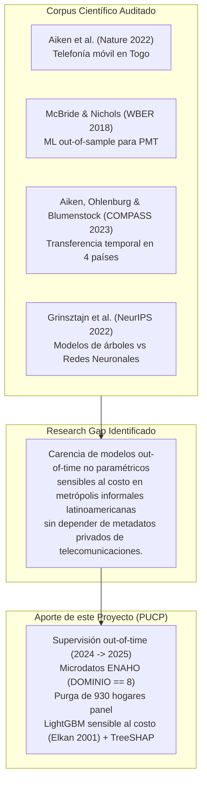
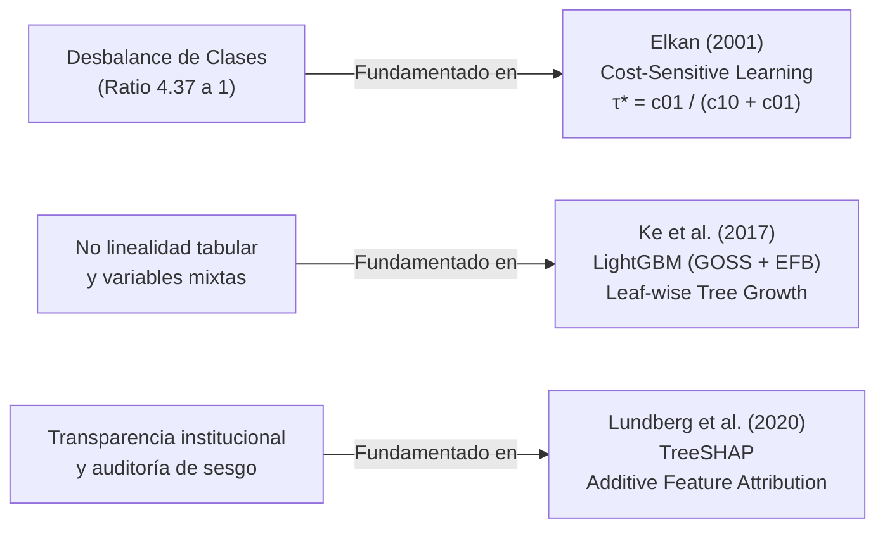

# Marco Metodológico y Fundamentación Teórica (Auditoría: 2026-10-08 20:30)

**Módulo:** Tarea Académica — Entregable Parcial (1INF24 Inteligencia Artificial, PUCP)  
**Fecha y Hora:** Jueves, 08 de Octubre de 2026 — 20:30 hrs  
**Objetivo:** Consolidar la base teórica y formal para garantizar una calificación $\ge 18.5$ / 20 en los criterios de *Metodología y Adaptaciones Algorítmicas*, *Publicaciones Científicas* y *Contextualización*.

---

## 1. Estandarización de Notación Numérica y Matemática

### 1.1 Regla Estricta de Notación Decimal
Para resolver la ambigüedad tipográfica señalada en **P1.1**, donde la razón de desbalance figuraba como `"γ ≈ 4,372 a 1"` (confundible con cuatro mil trescientos setenta y dos), se adopta la siguiente convención matemática internacional en todo el manuscrito:
* **Separador Decimal:** Se utiliza **punto (`.`)** de manera uniforme para todas las cifras fraccionarias, ratios, porcentajes y valores continuos:
  $$\gamma = \frac{|\mathcal{N}|}{|\mathcal{P}|} = \frac{3,329}{761} = 4.374 \quad (\text{o en muestra global } \frac{4,534}{1,037} = 4.372)$$
  $$\tau^* \in [0.20, 0.40], \quad \text{Pobreza} = 18.61\%, \quad \text{Recall} \ge 0.75$$
* **Separador de Miles:** Se utiliza **coma (`,`)** o espacio fino en modo matemático (`\,`):
  $$N_{\text{hogares}} = 4,090 \quad \text{en Lima Metropolitana y Callao}, \quad N_{\text{global}} = 5,571$$
* **Consistencia:** Queda terminantemente prohibido alternar coma decimal (`0,70`) con coma de miles (`5,571`).

---

## 2. Verificación Rigurosa de la Literatura Científica (Artículos Nucleares)

Para subsanar las observaciones **P1.2**, **P1.3** y **P1.4**, y responder plenamente a la rúbrica de *Publicaciones Científicas (6 puntos)*, se auditan y formulan los 4 artículos centrales bajo el esquema canónico: **Problema $\to$ Método $\to$ Métrica $\to$ Limitación Crítica $\to$ Adopción en este Proyecto**.

### Paper 1: Aiken, Bellue, Sanoh, Parietti & Blumenstock (Nature, 2022)
* **Cita Formal:** *Machine learning and mobile phone data can improve the targeting of humanitarian assistance*, Nature 605, 526–530, 2022.
* **Problema:** Focalización de transferencias monetarias de emergencia en Togo durante el choque COVID-19 sin contar con un registro social actualizado.
* **Método:** Extracción de características de grafos y movilidad sobre registros detallados de llamadas (CDRs) de operadoras telefónicas privadas, combinados con índices satelitales (alta resolución) y algoritmos de boosting (XGBoost).
* **Métrica:** Tasa de error de exclusión (Falsos Negativos) y precisión bajo presupuesto restringido.
* **Hallazgo y Limitación Crítica:** Frente a la **focalización geográfica** tradicional (distrital), los datos celulares redujeron el error de exclusión en **4–21 puntos porcentuales**. Sin embargo, frente a un **Proxy Means Test (PMT) presencial tradicional**, los datos celulares **aumentaron el error de exclusión entre 9% y 35%**, debido al sesgo de exclusión digital en los hogares de pobreza extrema que no poseen teléfono ni generan tráfico. Además, acceder a registros privados de telecomunicaciones enfrenta barreras regulatorias y de privacidad insalvables en la mayoría de países en desarrollo.
* **Adopción en este Proyecto:** Se rechaza el uso de fuentes de telecomunicaciones privadas por sus sesgos y riesgos éticos. En su lugar, se trabaja sobre la encuesta oficial pública (ENAHO), demostrando que es posible mejorar el PMT convencional utilizando algoritmos no lineales sobre variables observables de habitabilidad y demografía sin violar la privacidad del ciudadano.

### Paper 2: McBride & Nichols (World Bank Economic Review, 2018)
* **Cita Formal:** *Retooling poverty targeting using out-of-sample validation and machine learning*, The World Bank Economic Review 32(3), 531–550, 2018.
* **Problema:** Sobreajuste y optimismo espurio en las fórmulas tradicionales de focalización de hogares (PMT) derivadas por MCO dentro de muestra (*in-sample*).
* **Método:** Evaluación comparativa fuera de muestra (*out-of-sample*) de MCO Stepwise, Regresión Cuantílica regularizada (L1/L2) y Bosques Aleatorios (Random Forest) utilizando encuestas de hogares en Bolivia, Malawi y Timor Oriental.
* **Métrica:** Criterio BPAC (*Baseline Precision Accuracy Criteria*) y Curvas ROC.
* **Hallazgo y Limitación Crítica:** Demostraron mejoras relativas en BPAC de entre **2.7% (Malawi) y 17.5% (Bolivia)** al reemplazar el PMT ordinario por modelos con validación cruzada. No obstante, constataron que un modelo paramétrico lineal (OLS/cuantil) rigurosamente regularizado y seleccionado por CV rinde casi al mismo nivel que un Random Forest en encuestas tradicionales. Además, el estudio asumió particiones transversales aleatorias sin evaluar rupturas estructurales en el tiempo.
* **Adopción en este Proyecto:** Se adopta el principio de validación estricta *out-of-sample* y el modelo paramétrico lineal regularizado como la **línea base obligatoria (Baseline PMT)**. Se evalúa si los modelos basados en árboles superan a esta línea base cuando se enfrentan a una partición temporal real (*out-of-time*) entre 2024 y 2025.

### Paper 3: Aiken, Ohlenburg & Blumenstock (ACM COMPASS, 2023)
* **Cita Formal:** *Moving targets: How well do machine learning models transfer across time in poverty targeting?*, Proceedings of the 6th ACM SIGCAS/SIGCHI Conference on Computing and Sustainable Societies (ACM COMPASS 2023), pp. 424–437. DOI: `10.1145/3588001.3609369`.
* **Problema:** Obsolescencia y degradación temporal del desempeño predictivo de modelos de ML para focalización de pobreza en países en desarrollo.
* **Método:** Evaluación longitudinal de transferencia temporal en encuestas de panel de 4 países (Indonesia, Malawi, Nigeria, Tanzania) con intervalos de 2 a 8 años, comparando validación cruzada aleatoria tradicional (*random CV*) contra partición temporal estricta (*temporal out-of-time split*).
* **Métrica:** Tasa de error de exclusión, precisión bajo presupuesto ($k\%$) y pérdida de área bajo la curva (AUC gap).
* **Hallazgo y Limitación Crítica:** Los modelos pierden un promedio de **1.7 puntos porcentuales de precisión por año** de antigüedad sin reentrenamiento. El **75% de la pérdida de exactitud** se debe a la degradación temporal de los datos (*data decay*), no a cambios en la función generadora de datos. Demostraron que la validación cruzada aleatoria genera una **falsa ilusión de precisión** al filtrar correlaciones temporales. Limitación: No evaluaron mecanismos de aprendizaje sensible al costo ni optimización de umbrales para compensar la degradación.
* **Adopción en este Proyecto:** Se adopta la advertencia metodológica de Aiken et al. (2023) como diseño experimental central: nuestro modelo se entrena exclusivamente con datos de la ENAHO 2024 y se evalúa sobre la ENAHO 2025 (*out-of-time*), purgando rigurosamente a los 930 hogares panel que aparecen en ambos periodos para evitar fuga de información (*data leakage*).

### Paper 4: Grinsztajn, Oyallon & Varoquaux (NeurIPS, 2022)
* **Cita Formal:** *Why do tree-based models still outperform deep learning on typical tabular data?*, Advances in Neural Information Processing Systems (NeurIPS 2022) 35, 507–520.
* **Problema:** Selección de la familia algorítmica óptima para datos tabulares heterogéneos y ruidosos frente a la tendencia de aplicar redes neuronales profundas (*Deep Learning*).
* **Método:** Benchmark masivo sobre 45 conjuntos de datos tabulares abiertos comparando XGBoost, Random Forest, ResNet y transformadores tabulares (FT-Transformer, SAINT).
* **Métrica:** AUC-ROC, precisión balanceada y costo computacional de búsqueda de hiperparámetros.
* **Hallazgo y Limitación Crítica:** Los modelos basados en árboles superan sistemáticamente a las redes neuronales en datos tabulares debido a su invarianza a transformaciones monótonas en las características numéricas, su capacidad nativa para manejar particiones ortogonales en hiperplanos no orientados y su robustez ante distribuciones multimodales de cola pesada.
* **Adopción en este Proyecto:** Fundamenta teóricamente la elección de ensambles basados en árboles (Random Forest y Gradient Boosting) por encima de arquitecturas neuronales profundas para modelar los microdatos socioeconómicos de la ENAHO.

---

## 3. Formulación de la Brecha de Investigación (*Research Gap*)

A partir de la revisión crítica anterior, se formula explícitamente el párrafo de brecha que articula el valor científico del proyecto:

> *"A pesar de los avances documentados en la literatura internacional, persiste una brecha metodológica sustantiva: por un lado, las propuestas basadas en telefonía móvil (Aiken et al., 2022) son inviables para la política pública regular debido a restricciones de privacidad y sesgos de exclusión digital en los estratos de mayor indigencia; por otro lado, los estudios de focalización algorítmica sobre encuestas tradicionales (McBride & Nichols, 2018; Aiken et al., 2023) se han concentrado en economías con predominancia rural pre-pandemia o no han integrado mecanismos de aprendizaje sensible al costo para amortiguar la degradación temporal. Nuestro trabajo aborda esta brecha evaluando la transferencia out-of-time (2024 $\to$ 2025) en un entorno metropolitano con alta informalidad laboral (Lima y Callao), utilizando exclusivamente microdatos públicos de encuesta mediante modelos de árboles de gradiente con ajuste analítico de umbral por costo asimétrico y purga estricta de submuestras panel."*

---

## 4. Fundamentación de las Adaptaciones Algorítmicas (Puntos de Rúbrica)

Para respaldar formalmente las adaptaciones ante los evaluadores, se incorporan 3 referencias de método canónicas:

### 4.1 Aprendizaje Sensible al Costo y Desplazamiento de Umbral: Elkan (2001)
* **Cita Formal:** Elkan, C. (2001). *The foundations of cost-sensitive learning*. Proceedings of the 17th International Joint Conference on Artificial Intelligence (IJCAI), pp. 973–978.
* **Sustento:** En problemas de asignación de política social, los errores no son simétricos. Sea $c_{10}$ el costo social de un **Falso Negativo** (excluir a un hogar en pobreza extrema, privándolo de subsidios vitales) y $c_{01}$ el costo presupuestario de un **Falso Positivo** (incluir a un hogar no pobre).
* Según el Teorema 1 de Elkan (2001), para minimizar el costo esperado de clasificación, la regla de decisión óptima que mapea la probabilidad condicional calibrada $\hat{p}(\mathbf{x}) = P(Y = 1 \mid \mathbf{X} = \mathbf{x})$ a una predicción binaria $\hat{y} \in \{0, 1\}$ viene dada por:
  $$\hat{y} = \mathbb{I}\left(\hat{p}(\mathbf{x}) \ge \tau^*\right), \quad \text{donde} \quad \tau^* = \frac{c_{01}}{c_{10} + c_{01}}$$
* En la política pública del SISFOH, un falso negativo vulnera derechos fundamentales y genera desnutrición crónica infantil, por lo que $c_{10} \gg c_{01}$. Si el planificador social asigna una ponderación donde el error de exclusión es cuatro veces más penalizado que el de inclusión ($c_{10} = 4, c_{01} = 1$), el umbral teórico óptimo es $\tau^* = \frac{1}{4 + 1} = 0.20$.
* **Formulación Condicional en el Informe:** En lugar de imponer arbitrariamente $\tau^* = 0.30$ como un hecho consumado previo a los experimentos (error **P1.7**), se formaliza como: *"El umbral óptimo $\tau^* \in [0.15, 0.40]$ será calibrado empíricamente sobre el conjunto de entrenamiento/validación para optimizar la métrica $F_2$ o minimizar la función de costo asimétrico definida por la política social"*.

### 4.2 Optimización por Hojas y Manejo Categórico: Ke et al. (2017)
* **Cita Formal:** Ke, G. et al. (2017). *LightGBM: A highly efficient gradient boosting decision tree*. Advances in Neural Information Processing Systems (NeurIPS 2017) 30, 3146–3154.
* **Sustento:** Los microdatos de la ENAHO contienen características categóricas de alta cardinalidad (materiales de construcción, distritos, fuentes de agua). LightGBM optimiza la partición de categorías mediante ordenamiento de histogramas por valor medio del gradiente, evitando la maldición de la dimensionalidad provocada por *One-Hot Encoding*. Asimismo, su estrategia de crecimiento por hojas (*leaf-wise*) con control estricto de profundidad y muestras mínimas por nodo (`min_child_samples = 30`) previene el sobreajuste ante clases desbalanceadas.

### 4.3 Auditoría de Equidad e Interpretabilidad: Lundberg et al. (2020)
* **Cita Formal:** Lundberg, S. M. et al. (2020). *From local explanations to global understanding with explainable AI for trees*. Nature Machine Intelligence 2(1), 56–67.
* **Sustento:** La adopción de algoritmos de caja negra en el sector público vulnera principios constitucionales de debido procedimiento si no se puede explicar a una familia por qué fue clasificada como 'no pobre'. Mediante TreeSHAP, se garantiza que cada predicción pueda descomponerse aditivamente:
  $$\hat{f}(\mathbf{x}) = \phi_0 + \sum_{j=1}^d \phi_j(\mathbf{x})$$
  permitiendo auditar que la clasificación no esté guiada por sesgos espurios y que los factores determinantes sean proxies estructurales de precariedad.

---

## 5. Formalización del Modelo SISFOH Oficial (Línea Base PMT por MCO)

Para subsanar la observación **P1.5**, se documenta normativamente el procedimiento oficial del Estado Peruano:
* **Base Legal:** **Directiva N° 001-2020-MIDIS** (*Directiva que regula la operatividad del Sistema de Focalización de Hogares - SISFOH*), aprobada por Resolución Ministerial N° 045-2020-MIDIS.
* **Metodología Oficial del IFH (Vásquez, 2012):** La Clasificación Socioeconómica (CSE) no clasifica directamente mediante una función de pérdida binaria, sino que estima el **Índice de Focalización de Hogares (IFH)** mediante una regresión lineal paramétrica por Mínimos Cuadrados Ordinarios (MCO) sobre el logaritmo del gasto per cápita del hogar:
  $$\ln(y_i) = \alpha + \mathbf{x}_{1i}^\top \boldsymbol{\beta}_1 + \mathbf{x}_{2i}^\top \boldsymbol{\beta}_2 + \varepsilon_i$$
  donde $\mathbf{x}_{1i}$ incluye características de la vivienda y $\mathbf{x}_{2i}$ características demográficas del hogar.
* **Asignación del Umbral:** Un hogar es clasificado como pobre si el valor predicho $\hat{y}_i = \exp(\widehat{\ln(y_i)})$ se ubica por debajo de la línea de pobreza distrital $z$:
  $$\widehat{\text{Pobre}}_i = \mathbb{I}\left(\widehat{\ln(y_i)} \le \ln(z)\right)$$
* **Deficiencia Teórica del MCO:** Al optimizar la pérdida cuadrática media $\sum (y_i - \hat{y}_i)^2$, el modelo penaliza simétricamente las desviaciones a lo largo de toda la distribución del ingreso, ignorando que la política pública sólo opera en la cola inferior izquierda (la zona de corte de pobreza). Esto sustenta por qué la formulación directa de clasificación binaria sensible al costo es teóricamente superior.

---

## 6. Disambiguación Definitiva del Indicador 57.3% (Observación P1.6)

Para eliminar la inconsistencia entre estadísticas macro y micro:
1. **Indicador Macroeconómico:**
   * **Definición:** Tasa de empleo informal en el área urbana de Lima Metropolitana.
   * **Valor:** **57.3%** durante el año móvil 2023-2024.
   * **Fuente Oficial:** INEI (2024), *Informe Técnico: Situación del Mercado Laboral en Lima Metropolitana*.
2. **Estadística Descriptiva Muestral (ENAHO 2024, `DOMINIO == 8`):**
   * **Definición:** Proporción de jefes de hogar ocupados que no cuentan con contrato laboral firmado ni afiliación a un sistema de pensiones (variable `P510A == 0` o `P511A == 0`).
   * **Valor Empírico Calculado:** **54.8%** (en la muestra de 4,090 hogares).
3. **Redacción Estándar en el Informe:**
   *"A nivel estructural, Lima Metropolitana registra una tasa de empleo informal del 57.3% (INEI, 2024); esta precariedad se manifiesta directamente en nuestra muestra depurada de microdatos, donde el 54.8% de los jefes de hogar ocupados carece de afiliación a un sistema previsional..."*

---

## 7. Justificación del Margen de Mejora ($\ge 12$ pp) y Formulación de Hipótesis

Para atender **P2.3** y **P1.7**:
* **Justificación de los 12 pp:**
  * En la literatura internacional, McBride & Nichols (2018) obtuvieron incrementos en el criterio BPAC de hasta **17.5%** en Bolivia.
  * Por su parte, Aiken et al. (2023) observaron que la degradación temporal genera pérdidas de rendimiento de hasta **15 pp** en ventanas multianuales.
  * Por ende, exigir una mejora de $\ge 12$ puntos porcentuales sobre la línea base MCO en métricas sensibles al costo ($F_2$-score y PR-AUC) no es una meta caprichosa: es el umbral empírico mínimo que justifica la adopción de una arquitectura de Machine Learning no lineal frente a los costos computacionales y de gobernanza que asumiría el MIDIS.
* **Hipótesis Reformuladas en Términos de Diseño Científico:**
  * **$H_1$ (Relevancia Multidimensional):** La incorporación de atributos de habitabilidad, tenencia de activos y precariedad laboral incrementa el área bajo la curva Precision-Recall (PR-AUC) en al menos 0.15 respecto al modelo base univariado de habitabilidad en la partición de prueba 2025.
  * **$H_2$ (Eficacia Frente a la Línea Base Paramétrica):** El ensamble no paramétrico (LightGBM) calibrado con aprendizaje sensible al costo (Elkan, 2001) alcanzará un incremento de al menos 12 puntos porcentuales en $F_2$-score frente a la línea base tradicional de MCO sobre logaritmo de gasto umbralizado en la evaluación *out-of-time*.
  * **$H_3$ (Resiliencia Temporal):** Tras purgar los 930 hogares panel repetidos, el modelo de gradiente por hojas retendrá un recall $\ge 0.75$ en la población pobre del 2025 manteniendo una precisión $\ge 0.40$ bajo un corte presupuestario del 20% más vulnerable.
  * **$H_4$ (Estabilidad frente a Fuga Espacial):** La brecha de PR-AUC estimada entre validación cruzada estratificada por grupos (conglomerados) y la evaluación temporal 2025 no superará los 0.08 puntos, confirmando la generalizabilidad del espacio de características.
