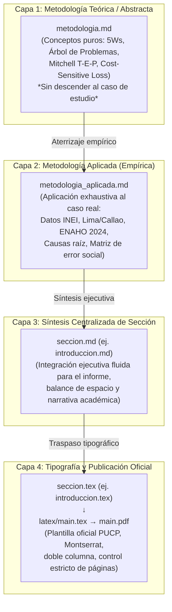

# Sistema de Documentación Modular (Architecture & Workflow)

Este directorio alberga la memoria metodológica, los borradores analíticos y el código fuente tipográfico en $\text{\LaTeX}$ del informe académico para el curso de **Inteligencia Artificial (1INF24 - PUCP)**.

Para garantizar la máxima rigurosidad académica, auditabilidad y mantenibilidad, la documentación adopta una **Arquitectura en 4 Capas de Separación de Responsabilidades**:



> [!IMPORTANT]
> **FUENTE OFICIAL DE LA VERDAD Y EVALUACIÓN:**  
> La versión definitiva, consolidada y evaluable para la entrega de la Tarea Académica reside **exclusivamente en la Capa 4** ([`Documentation/latex/main.tex`](./latex/main.tex) y [`main.pdf`](./latex/main.pdf)) junto con [`Observaciones a levantar/log_cambios_2026-10-08_21-04.md`](./Observaciones%20a%20levantar/log_cambios_2026-10-08_21-04.md). Los borradores intermedios en Markdown de las Capas 1 a 3 contienen cifras preliminares exploratorias y han quedado superados.
>
> **Descarga de Microdatos con Git LFS:**  
> Los archivos CSV de la ENAHO en `Data/` están gestionados mediante **Git LFS**. Para descargarlos antes de ejecutar cualquier script:
> ```bash
> git lfs install
> git lfs pull
> ```

---

## 1. La Arquitectura en 4 Capas

### Capa 1: Metodología Teórica (`<subpunto>/metodologia.md`)
* **Propósito:** Definir formalmente la herramienta analítica, el marco conceptual o el algoritmo utilizado desde una perspectiva puramente abstracta.
* **Estado:** Borradores teóricos exploratorios iniciales.

### Capa 2: Metodología Aplicada (`<subpunto>/metodologia_aplicada.md`)
* **Propósito:** Aplicación preliminar de la metodología al caso de estudio.
* **Estado:** *Superada.* Los borradores `.md` tempranos conservan delimitaciones previas (alcance departamental de 5,571 hogares). La delimitación oficial y rigurosa es Lima Metropolitana (`DOMINIO 8`, 4,090 hogares), consolidada en la Capa 4.

### Capa 3: Síntesis Centralizada de Sección (`<seccion>/<seccion>.md`)
* **Propósito:** Resúmenes ejecutivos en Markdown de cada sección.
* **Estado:** Borradores de trabajo intermedios.

### Capa 4: Publicación en $\text{\LaTeX}$ (`<seccion>/<seccion>.tex` $\to$ `latex/main.pdf`)
* **Propósito:** **Entregable oficial único y evaluable** presentado a la cátedra de Inteligencia Artificial (1INF24).
* **Implementación:** Archivo `.tex` modular por sección importado en `Documentation/latex/main.tex` mediante `\input{../sections/...}`.
* **Estándar Visual:** Tipografía Montserrat oficial, paleta de colores institucional PUCP (`#015D34` verde bosque, `#009A74` verde esmeralda, `#40B497` menta), tablas en `booktabs`, control estricto de 4 páginas de cuerpo sin bibliografía y 0 errores de compilación.

---

## 2. Estructura de Directorios

```text
Documentation/
├── README.md                                 # Guía del sistema de documentación (este archivo)
├── 1INF24-Guia-TA-2026-2.pdf                 # Rúbrica oficial y guía de la Tarea Académica PUCP
├── Formato de Informe de Tarea Académica.docx# Plantilla original de Word de la PUCP
│
├── latex/                                    # Compilador maestro de LaTeX
│   ├── main.tex                              # Documento raíz que ensambla todas las secciones
│   ├── main.pdf                              # Entregable final compilado (evaluable)
│   ├── references.bib                        # Base de datos de referencias bibliográficas (verificada)
│   └── figures/                              # Figuras auxiliares
│
└── sections/                                 # Capítulos modulares del informe
    ├── 01_introduccion/
    │   ├── 01_identificacion_problema/       # Sub-punto 1: Diagnóstico del problema
    │   │   ├── metodologia.md                # Teoría pura (5Ws, Árbol CEPAL, Matriz de error)
    │   │   └── metodologia_aplicada.md       # Aplicación real (Lima/Callao, ENAHO 2024, 71% sin ayuda)
    │   ├── 02_justificacion_paradigma/       # Sub-punto 2: ¿Por qué clasificación binaria? (en progreso)
    │   ├── 03_hipotesis_objetivos/           # Sub-punto 3: Formulación de hipótesis y objetivos
    │   ├── introduccion.md                   # Síntesis centralizada en Markdown de la Sección 1
    │   └── introduccion.tex                  # Markup LaTeX importado en main.tex
    │
    ├── 02_trabajos_relacionados/             # Sección 2: Estado del arte y literatura científica
    ├── 03_metodologia/                       # Sección 3: Pipeline técnico, operadores y algoritmos
    │   ├── 01_formulacion_problema/          # Sub-punto 1: Tarea T-E-P, espacios X/Y, Cost-Sensitive Loss
    │   │   ├── metodologia.md                # Teoría pura de Mitchell y funciones de costo asimétricas
    │   │   └── metodologia_aplicada.md       # Aplicación en ENAHO (5,571 hogares, ratio 1:4.372)
    │   ├── 02_comportamiento_entrada_salida/ # Sub-punto 2: Contratos vectoriales y Cero Fuga
    │   │   ├── metodologia.md                # Teoría de espacios de entrada/salida y preservación causal
    │   │   └── metodologia_aplicada.md       # Vectores modulares (viv, dem, educ, emp) y diagnóstico EDA
    │   ├── 03_operadores_algoritmos_adaptaciones/ # Sub-punto 3: Operadores específicos y jerarquía
    │   │   ├── metodologia.md                # Teoría de propagación cluster, reducción 1:M y sesgo inductivo
    │   │   └── metodologia_aplicada.md       # Clases Python (HousingCohort, Aggregator, DomainBinner)
    │   ├── 04_figuras_diagramas/             # Sub-punto 4: Representación visual del pipeline y EDA
    │   │   ├── metodologia.md                # Teoría de autosuficiencia visual y semiótica en ML (IEEE)
    │   │   └── metodologia_aplicada.md       # Catálogo de figuras (Pipeline, Domain Binning, Cost-Curve)
    │   ├── metodologia.md                    # Síntesis centralizada en Markdown de la Sección 3
    │   └── metodologia.tex                   # Markup LaTeX importado en main.tex
    ├── 04_experimentacion_resultados/        # Sección 4: Métricas, curvas PR-AUC y análisis SHAP
    ├── 05_conclusion/                        # Sección 5: Conclusiones del estudio
    ├── 06_sugerencias_futuras/               # Sección 6: Extensiones y trabajos futuros
    ├── 07_implicancias_eticas/               # Sección 7: Equidad, sesgo y justicia algorítmica
    ├── 08_link_repositorio/                  # Sección 8: Enlace y credenciales del repositorio GitHub
    ├── 09_declaracion_contribucion/          # Sección 9: Matriz de roles y aportes de cada integrante
    ├── 10_declaracion_ia/                    # Sección 10: Declaración de uso ético de herramientas de IA
    └── 11_referencias/                       # Sección 11: Base bibliográfica IEEE y archivo .bib
```

---

## 3. Flujo de Trabajo para Escribir y Modificar (Workflow)

Cuando se desarrolle o corrija un punto del informe, se debe seguir estrictamente este flujo secuencial:

```text
  [1. Marco Teórico]       --> Define el concepto puro en <punto>/metodologia.md
          ↓
  [2. Aterrizaje Empírico]  --> Desarrolla el caso con datos en <punto>/metodologia_aplicada.md
          ↓
  [3. Síntesis Ejecutiva]  --> Redacta la versión condensada en <seccion>/<seccion>.md
          ↓
  [4. Traspaso a LaTeX]    --> Convierte a <seccion>.tex respetando etiquetas y fórmulas
          ↓
  [5. Compilación y Test]  --> Compila pdflatex y verifica el límite de páginas (≤ 4 páginas en parcial)
```

### ¿Por qué este flujo evita errores?
1. **No se mezclan opiniones con teoría:** Si alguien cuestiona una técnica (ej. *"¿Por qué usas un árbol de problemas?"*), la justificación está en `metodologia.md`.
2. **No se pierden los cálculos:** Si el docente pregunta *"¿De dónde salió que el 71.26% de los pobres no recibe transferencias?"*, el paso a paso exacto y la consulta en Python están documentados en `metodologia_aplicada.md`.
3. **Mantenibilidad quirúrgica:** Si se corrige una cifra o se añade un nuevo año de encuesta, solo se modifica el archivo aplicado correspondiente, se ajusta el resumen de la sección y se recompila el PDF, sin tener que reescribir todo el documento.

---

## 4. Restricciones y Parámetros de Publicación

| Parámetro | Entregable Parcial (Fase 1) | Entregable Final (Fase 2) |
| :--- | :--- | :--- |
| **Límite de Páginas** | **Máximo 4 páginas** (sin incluir bibliografía) | **Máximo 8 páginas** (sin incluir bibliografía) |
| **Formato Tipográfico** | Doble columna, fuente Montserrat, interlineado sencillo | Doble columna, fuente Montserrat, interlineado sencillo |
| **Paleta de Colores** | `#015D34` (Títulos), `#009A74` (Subtítulos), `#40B497` (Acentos) | `#015D34` (Títulos), `#009A74` (Subtítulos), `#40B497` (Acentos) |
| **Formato de Citas** | Estilo IEEE numérico `[1]`, `[2]` | Estilo IEEE numérico `[1]`, `[2]` |
| **Compilador** | `pdflatex` (TeX Live 2026) | `pdflatex` (TeX Live 2026) |
