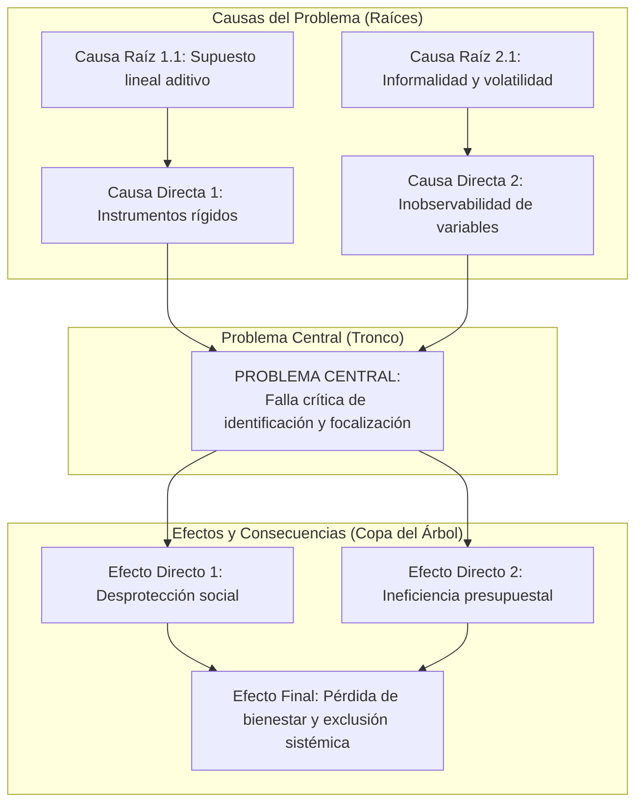

# Marco Metodológico Teórico: Identificación y Delimitación del Problema

Este documento define de manera puramente conceptual y abstracta las técnicas y metodologías analíticas empleadas para diagnosticar, estructurar y delimitar un problema complejo de política pública y modelado de datos, **sin descender aún al caso de estudio específico**.

---

## 1. El Marco de Interrogación Sistemática 5Ws + 1H

El marco analítico de las **5Ws + 1H** (*Who, What, Where, When, Why, How*) es una técnica de formulación heurística que busca evitar ambigüedades y delimitaciones deficientes en la definición de un problema de ingeniería o políticas públicas.

Su objetivo metodológico es aislar el núcleo disfuncional del sistema antes de proponer cualquier solución tecnológica o computacional.

```text
┌────────────────────────────────────────────────────────────────────────┐
│                      DIMENSIONES DEL MARCO 5Ws + 1H                    │
├─────────┬──────────────────────┬───────────────────────────────────────┤
│ Dimensión│ Pregunta Esencial    │ Criterio de Rigor Metodológico         │
├─────────┼──────────────────────┼───────────────────────────────────────┤
│ WHO     │ ¿Quiénes son los     │ Desglosar agentes primarios (afectados│
│         │ afectados y actores? │ directos) y secundarios (instituciones│
│         │                      │ evaluadoras, reguladores y sociedad). │
├─────────┼──────────────────────┼───────────────────────────────────────┤
│ WHAT    │ ¿Qué déficit o falla │ Expresar el problema como un estado   │
│         │ ocurre exactamente?  │ negativo real observable, NO como la  │
│         │                      │ "falta de una solución tecnológica".  │
├─────────┼──────────────────────┼───────────────────────────────────────┤
│ WHERE   │ ¿Dónde ocurre el     │ Establecer límites geográficos,       │
│         │ fenómeno?            │ administrativos y espaciales claros.  │
├─────────┼──────────────────────┼───────────────────────────────────────┤
│ WHEN    │ ¿Cuándo se manifiesta│ Identificar horizonte temporal, ciclos│
│         │ y qué periodicidad?  │ de estacionalidad y coyunturas macro. │
├─────────┼──────────────────────┼───────────────────────────────────────┤
│ WHY     │ ¿Por qué ocurre?     │ Mapear los mecanismos causales y      │
│         │                      │ restricciones estructurales del medio.│
├─────────┼──────────────────────┼───────────────────────────────────────┤
│ HOW     │ ¿Cómo se manifiesta  │ Cuantificar las métricas de severidad,│
│         │ el impacto medible?  │ costos sociales y formas de daño.     │
└─────────┴──────────────────────┴───────────────────────────────────────┘
```

---

## 2. Metodología del Árbol de Problemas (Enfoque de Marco Lógico CEPAL / BID)

El **Árbol de Problemas** es una técnica diagnóstica estructurada desarrollada en el marco de la gestión de proyectos de desarrollo (CEPAL / Banco Interamericano de Desarrollo) para establecer relaciones de **causa-efecto inequívocas**.

### Principios Fundamentales:
1. **Unicidad del Problema Central:** Se debe identificar un único problema focal que describa la situación disfuncional no deseada.
2. **Causalidad Ascendente (Raíces):** Las causas se disponen en niveles jerárquicos (causas directas y causas raíz o estructurales). Una causa nunca debe redactarse como "falta de software" o "falta de modelo", sino como la condición del entorno que produce el fallo.
3. **Efectos Descendentes / Ramificaciones (Copa):** Muestran el impacto progresivo del problema sobre los agentes y el sistema económico si no se interviene.



---

## 3. Análisis de Brecha de Cobertura y Matriz de Error Social

En la economía del bienestar y el diseño de redes de protección social (Coady, Grosh & Hoddinott, Banco Mundial), la evaluación de cualquier mecanismo de focalización se formaliza a través de la **Matriz de Error Social**:

$$\begin{array}{c|c|c}
\text{Condición Real} \setminus \text{Veredicto del Instrumento} & \text{Identificado como Elegible } (\hat{y}=1) & \text{No Identificado } (\hat{y}=0) \\
\hline
\text{Elegible en Necesidad } (y=1) & \text{Verdadero Positivo (Cobertura Efectiva)} & \mathbf{\text{Error de Exclusión (Falso Negativo)}} \\
\hline
\text{No Elegible } (y=0) & \mathbf{\text{Error de Inclusión (Falso Positivo / Fuga)}} & \text{Verdadero Negativo (Exclusión Correcta)}
\end{array}$$

### Asimetría Crítica de los Costos Sociales:
* **Costo del Error de Exclusión ($C_{FN}$):** Priva a una unidad vulnerable de la subsistencia básica o la asistencia alimentaria. Su costo es humanamente severo, irreversible e induce trampas de pobreza intergeneracionales.
* **Costo del Error de Inclusión ($C_{FP}$):** Transfiere recursos públicos a una unidad no vulnerable. Genera ineficiencia fiscal de costo finito y recuperable.
* **Axioma Metodológico:** Todo problema de identificación y focalización en contextos sociales opera bajo una estructura asimétrica estricta:
  $$C_{FN} \gg C_{FP}$$

---

## 4. Principio de Proxies Observables y No Falsificables (*Permanent Income Hypothesis*)

Derivado de la teoría económica del consumo de Milton Friedman (1957) y de los mecanismos de información asimétrica de Stiglitz (1986):

1. **Invalidez de Flujos Monetarios Corrientes en Entornos Informales:**
   El ingreso monetario corriente declarado a corto plazo sufre de **alta volatilidad estacional** y **subreporte deliberado sistemático** (aversión fiscal, desconfianza o incentivos perversos para calificar a subsidios).
2. **Propiedades de un Proxy Robusto de Bienestar:**
   Para centrar un problema de inferencia socioeconómica, las variables observables deben cumplir con tres axiomas:
   * **Inercia Temporal:** Representar activos duraderos acumulados a lo largo del tiempo (calidad de materiales físicos, infraestructura de servicios fijos en red, nivel educativo alcanzado).
   * **Verificabilidad Externa:** Atributos de bajo costo de inspección física directa que no dependan del mero testimonio del encuestado.
   * **Dificultad de Manipulación Estratégica:** Características que un individuo no puede falsificar o alterar de un día a otro para simular vulnerabilidad (*gaming the system*).
