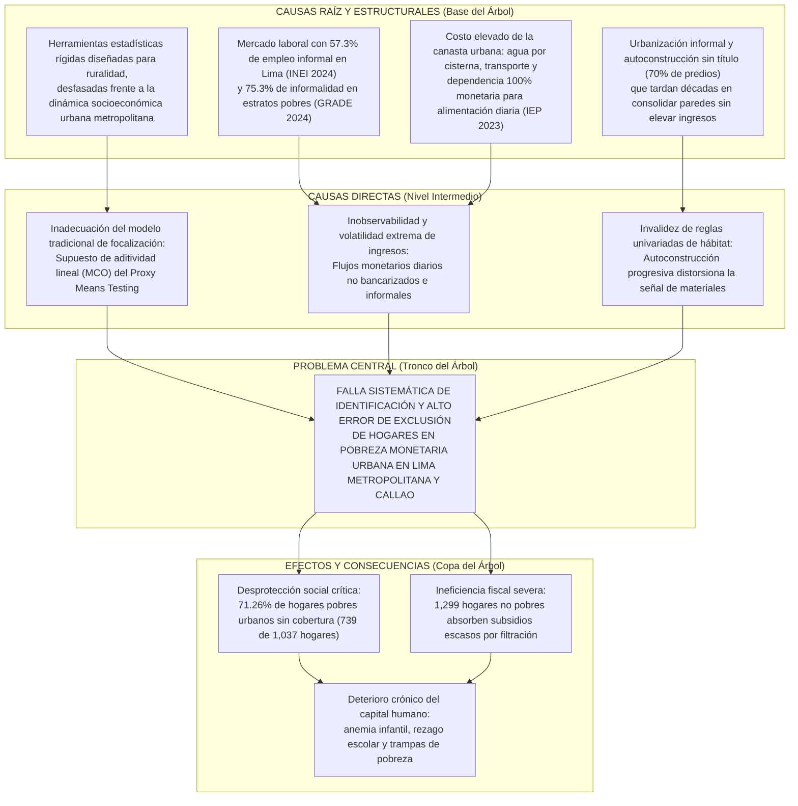

# Metodología Aplicada: Identificación y Delimitación del Problema

Este documento aplica las herramientas metodológicas abstractas (5Ws+1H, Árbol de Problemas, Matriz de Error Social y Teoría de Proxies) de manera exhaustiva y detallada a la problemática de la **pobreza urbana y fallas de identificación en Lima Metropolitana y el Callao**, **sin adelantarse a formular soluciones técnicas ni algoritmos**.

---

## 1. Aplicación del Marco 5Ws + 1H a la Pobreza Urbana en Lima y Callao

```text
┌────────────────────────────────────────────────────────────────────────────────────────────────────────┐
│                     MATRIZ 5Ws + 1H APLICADA AL CONTEXTO DE LIMA METROPOLITANA Y CALLAO                 │
├─────────┬──────────────────────────────────────────────────────────────────────────────────────────────┤
│ WHO     │ • Población Afectada: ~2.8 a 2.9 millones de personas en pobreza monetaria urbana en Lima    │
│ (Quién) │   Metropolitana y Callao (28.2% de personas según INEI 2024; 18.61% de hogares muestreados). │
│         │ • Grupos en Alta Vulnerabilidad: Familias dependientes del autoempleo e informalidad laboral  │
│         │   (57.3% en Lima según INEI 2024), hogares con jefatura femenina monoparental y hogares con  │
│         │   elevada carga de niños menores de 5 años o adultos mayores con enfermedades crónicas.      │
│         │ • Actores Institucionales: El Ministerio de Desarrollo e Inclusión Social (MIDIS), el       │
│         │   Sistema de Focalización de Hogares (SISFOH) y el INEI como ente rector estadístico.        │
├─────────┼──────────────────────────────────────────────────────────────────────────────────────────────┤
│ WHAT    │ • Falla Estructural de Focalización: El sistema público tradicional de clasificación socio-  │
│ (Qué)   │   económica presenta una grave brecha de subcobertura y exclusión en el entorno urbano.      │
│         │ • Evidencia Cuantitativa Oficial (ENAHO 2024): De los 1,037 hogares en pobreza en Lima y     │
│         │   Callao, 739 hogares (71.26%) NO reciben ninguna transferencia pública monetaria o          │
│         │   alimentaria (INGTPUHD == 0). Son "hogares invisibles" para las redes de protección social. │
│         │ • Filtración Concurrente: 1,299 hogares catalogados como no pobres reciben subsidios públicos│
│         │   debido a instrumentos descalibrados y reglas aditivas rígidas.                             │
├─────────┼──────────────────────────────────────────────────────────────────────────────────────────────┤
│ WHERE   │ • Ámbito Geográfico: Ámbito metropolitano consolidado y periférico de Lima Metropolitana    │
│ (Dónde) │   (Departamento 15, Provincia 01, 43 distritos) y la Provincia Constitucional del Callao     │
│         │   (Departamento 07, 7 distritos).                                                            │
│         │ • Tipología Territorial: Alta concentración en conos urbanos periurbanos (Lima Norte, Este,  │
│         │   Sur) y zonas de ladera/autoconstrucción progresiva informal (GRADE 2024).                  │
├─────────┼──────────────────────────────────────────────────────────────────────────────────────────────┤
│ WHEN    │ • Ventana Temporal: Periodo post-pandemia y choques inflacionarios recientes (2022 - 2024).  │
│ (Cuándo)│ • Dinámica Temporal: La pobreza urbana en Lima se duplicó respecto a los niveles de 2019     │
│         │   (14.2% prepandemia a 28.7% en 2023 y 28.2% en 2024), evidenciando una recuperación frágil,│
│         │   volátil y no consolidada tras la crisis sanitaria y el alza del costo de la canasta básica.│
├─────────┼──────────────────────────────────────────────────────────────────────────────────────────────┤
│ WHY     │ 1. Informalidad Laboral Extrema: El 57.3% de la PEA ocupada en Lima labora en el sector       │
│ (Por qué│    informal, generando ingresos no registrados en planilla, erráticos y no observables.      │
│ -Causas)│ 2. Falla Paramétrica Lineal del PMT: El SISFOH aplica regresiones lineales MCO aditivas que   │
│         │    asumen efectos independientes, incapaces de capturar interacciones socioeconómicas complejas.│
│         │ 3. Falacia de la Autoconstrucción (Mito Univariado): El 70% de las viviendas en Lima se       │
│         │    autoconstruyen informalmente a lo largo de décadas (GRADE 2024). Por ello, el 59.4% de los│
│         │    pobres vive en casas de ladrillo y el 79.5% con piso noble; evaluar solo vivienda falla. │
│         │ 4. "Pobreza Urbana Cara": Alto costo de vida en Lima (agua por cisterna hasta 6 veces más    │
│         │    cara que por red, transporte costoso y 100% de dependencia del mercado alimentario, IEP). │
├─────────┼──────────────────────────────────────────────────────────────────────────────────────────────┤
│ HOW     │ • Inseguridad alimentaria urbana severa y proliferación de ollas comunes como mecanismo de   │
│ (Cómo se│   subsistencia espontánea ante la inacción estatal.                                          │
│ manif.) │ • Perpetuación de trampas de pobreza intergeneracional por desnutrición y deserción escolar. │
│         │ • Ineficiencia en el gasto fiscal por asignación errónea de subsidios escasos.               │
└─────────┴──────────────────────────────────────────────────────────────────────────────────────────────┘
```

---

## 2. Aplicación de la Metodología del Árbol de Problemas



---

## 3. Aplicación de la Matriz de Error Social con Microdatos de Lima y Callao (ENAHO 2024)

Al cruzar los microdatos oficiales de la ENAHO 2024 para Lima y Callao ($N = 5,571$ hogares), se constata la siguiente distribución real de la focalización estatal:

$$\begin{array}{c|c|c|c}
\text{Condición Real de Pobreza (Sumaria)} & \text{Recibe Subsidio Público } (\text{INGTPUHD} > 0) & \text{NO Recibe Subsidio } (\text{INGTPUHD} = 0) & \text{Total} \\
\hline
\mathbf{\text{Pobre (Extremo y No Extremo)}} & 298 \text{ hogares } (28.74\%) & \mathbf{739 \text{ hogares } (71.26\%)} & 1,037 \text{ hogares} \\
& \text{Cobertura Efectiva} & \mathbf{\text{Error de Exclusión (Falso Negativo)}} & (100\%) \\
\hline
\mathbf{\text{No Pobre}} & \mathbf{1,299 \text{ hogares } (28.65\%)} & 3,235 \text{ hogares } (71.35\%) & 4,534 \text{ hogares} \\
& \mathbf{\text{Error de Inclusión (Filtración)}} & \text{Exclusión Correcta} & (100\%) \\
\hline
\text{Total Muestral} & 1,597 \text{ hogares} & 3,974 \text{ hogares} & 5,571 \text{ hogares}
\end{array}$$

### Justificación de la Asimetría del Problema:
1. **El Error de Exclusión ($FN = 739$ hogares, 71.26%):** Constituye el fallo más grave del sistema actual. Deja a familias en situación de indigencia o privación alimentaria sin acceso a programas de supervivencia básica como el Vaso de Leche o Comedores Populares.
2. **El Error de Inclusión ($FP = 1,299$ hogares):** Aunque representa ineficiencia fiscal, no compromete la integridad física ni la supervivencia de las personas.
3. **Conclusión Metodológica:** La delimitación del problema exige formular una arquitectura que penalice drásticamente los Falsos Negativos sobre los Falsos Positivos.

---

## 4. Delimitación del Espacio de Proxies Observables

Para resolver el problema sin caer en la trampa del subreporte de ingresos, la teoría de los proxies no falsificables delimita qué información debe alimentar el diagnóstico:

1. **Variables Descartadas (Inadmisibles por alta volatilidad o falsificación):**
   * *Ingreso monetario total declarado:* Descartado por subreporte deliberado y volatilidad del empleo informal diario (jornaleros, ambulantes).
2. **Variables Priorizadas (Activos observables, duraderos y de bajo costo de verificación):**
   * *Módulo 01 (Vivienda y Hábitat):* Acceso a redes públicas de agua y saneamiento (variable de red no manipulable), combustible de cocina, tenencia jurídica (título SUNARP), grado de hacinamiento por número de habitaciones.
   * *Módulo 02 (Estructura Demográfica y Salud):* Razón de dependencia demográfica (menores y adultos mayores / adultos en edad laboral), presencia de enfermedades crónicas o miembros con discapacidad severa en el hogar (gasto catastrófico de bolsillo).
   * *Módulo 03 (Capital Humano y Educación):* Años de educación formal del jefe de hogar, máximo nivel educativo acumulado en la familia.
   * *Módulo 05 (Inserción Laboral):* Condición de informalidad real (empleo sin registro mercantil ni aportes a pensión), horas semanales trabajadas, estabilidad ocupacional.

---

## 5. Delimitación Estricta: Lo que Este Problema Aborda y lo que NO Aborda

* **Lo que SÍ delimita el problema:**
  * La incapacidad de los métodos tradicionales para identificar de forma precisa y oportuna la pobreza urbana en Lima Metropolitana y Callao.
  * La demostración empírica de la falla de los modelos aditivos lineales y los proxies univariados de vivienda.
  * La necesidad de evaluar el fenómeno como una interacción no lineal multidimensional de proxies observables.
* **Lo que NO se incluye en esta etapa:**
  * No se formula todavía la solución técnica algorítmica específica (modelos, hiperparámetros o hipótesis empíricas de desempeño).
  * No se evalúan políticas de intervención económica post-clasificación (rediseño de subsidios monetarios).
