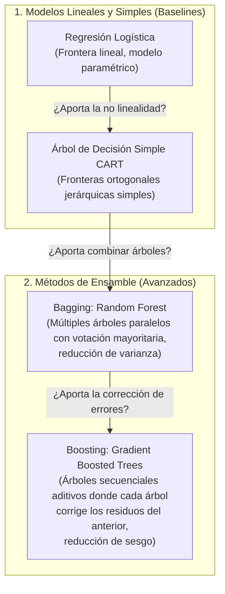

# Marco Metodológico Teórico: Formulación de Hipótesis y Preguntas de Investigación en Inteligencia Artificial

Este documento expone los fundamentos metodológicos, formales y abstractos para la formulación de preguntas de investigación e hipótesis científicas contrastables en el ámbito del **Aprendizaje Automático Supervisado**, **sin descender aún al caso de estudio particular**.

---

## 1. El Marco PICOT Adaptado a Aprendizaje Automático

El marco **PICOT** (*Population, Intervention, Comparison, Outcome, Timeframe*), ampliamente utilizado en investigación cuantitativa y ciencias experimentales, se adapta a la Inteligencia Artificial para garantizar que las preguntas de investigación sean operacionales y técnicamente completas.

```text
┌────────────────────────────────────────────────────────────────────────┐
│                      DIMENSIONES DEL MARCO PICOT EN IA                 │
├─────────┬──────────────────────┬───────────────────────────────────────┤
│ Dimensión│ Definición Teórica   │ Significado en Machine Learning       │
├─────────┼──────────────────────┼───────────────────────────────────────┤
│ P       │ Population (Datos)   │ La distribución subyacente y espacio  │
│         │                      │ muestral de instancias de evaluación. │
├─────────┼──────────────────────┼───────────────────────────────────────┤
│ I       │ Intervention (Modelo)│ La arquitectura o técnica de IA cuya  │
│         │                      │ capacidad predictiva se pone a prueba.│
├─────────┼──────────────────────┼───────────────────────────────────────┤
│ C       │ Comparison (Baseline)│ El modelo de referencia del estado del│
│         │                      │ arte o método estándar a superar.     │
├─────────┼──────────────────────┼───────────────────────────────────────┤
│ O       │ Outcome (Métricas)   │ Las funciones objetivas cuantitativas  │
│         │                      │ que miden el rendimiento del modelo.  │
├─────────┼──────────────────────┼───────────────────────────────────────┤
│ T       │ Timeframe (Horizonte)│ El esquema de partición temporal o    │
│         │                      │ generalización fuera de tiempo (OOT). │
└─────────┴──────────────────────┴───────────────────────────────────────┘
```

---

## 2. El Marco FINER de Viabilidad Científica

Para determinar si una pregunta de investigación amerita el esfuerzo computacional y experimental, se evalúa bajo los cinco criterios del marco **FINER** (Hulley et al.):

1. **Feasible (Factible):** Debe existir disponibilidad real de datos etiquetados de calidad, capacidad de cómputo razonable y tiempo acotado al ciclo del proyecto.
2. **Interesting (Interesante):** Debe despertar el interés de la comunidad académica y de los evaluadores, aportando valor conceptual.
3. **Novel (Novedosa):** Debe explorar una comparación o adaptación no trivial frente a aproximaciones ingenuas o heurísticas simplistas.
4. **Ethical (Ética):** Debe evaluar los riesgos y consecuencias de los errores del sistema (minimizando impactos asimétricos perjudiciales para los sujetos clasificados).
5. **Relevant (Relevante):** Sus conclusiones deben contribuir a resolver una problemática real o abrir líneas de aplicación práctica concretas.

---

## 3. Criterio Falsacionista de Karl Popper en Ciencias de la Computación

En epistemología de la ciencia (Karl Popper, 1959), una proposición solo adquiere estatus de **hipótesis científica** si es **falsable**; es decir, si existe un experimento empírico reproducible capaz de refutarla mediante evidencia cuantitativa.

### Estructura Canónica de una Hipótesis en Machine Learning:
$$\text{Dado } [P \text{ (Conjunto de Datos)}], \text{ la implementación de } [I \text{ (Modelo Propuesto)}] \text{ logrará un incremento } [\Delta \ge \delta \text{ en Métrica } O]$$
$$\text{frente al } [C \text{ (Modelo Baseline)}], \text{ evaluado bajo } [T \text{ (Esquema de Validación Riguroso)}].$$

* **Regla de Rechazo:** Si $\Delta < \delta$ o la diferencia de rendimiento no alcanza significancia estadística ($p \ge \alpha$), la hipótesis nula ($H_0$) no se rechaza, concluyendo que la intervención no supera al baseline.

---

## 4. Teoría de Evaluación en Clasificación con Clases Desbalanceadas

### La Paradoja de la Exactitud (*Accuracy Paradox*)
En problemas donde la clase de interés positivo ($y=1$) es minoritaria frente a la clase negativa ($y=0$):
$$\text{Tasa de Positivos } \pi = P(y=1) \ll 0.5$$
La métrica convencional de Exactitud (*Accuracy*):
$$\text{Accuracy} = \frac{TP + TN}{TP + TN + FP + FN}$$
induce un sesgo patológico: un clasificador trivial o constante que prediga siempre $\hat{y}=0$ alcanza una exactitud engañosa de $1 - \pi$, pero posee una **tasa de detección nula** ($TP = 0, \text{Recall} = 0$).

### Métricas Robustas para la Clase Minoritaria:
1. **Sensibilidad o Recall ($R$):**
   $$R = \frac{TP}{TP + FN}$$
   Mide la capacidad del modelo para capturar a los miembros verdaderos de la clase positiva, penalizando los Falsos Negativos.
2. **Precisión ($P$):**
   $$P = \frac{TP}{TP + FP}$$
   Mide la pureza o confiabilidad de las alertas positivas emitidas por el modelo, penalizando los Falsos Positivos.
3. **Puntaje $F_1$ ($F_1$-score):**
   $$F_1 = 2 \cdot \frac{P \cdot R}{P + R} = \frac{2TP}{2TP + FP + FN}$$
   Es la media armónica entre Precision y Recall. Asigna un valor de cero si cualquiera de las dos métricas fundamentales colapsa, obligando al modelo a aprender un balance efectivo.
4. **Área Bajo la Curva Precision-Recall (PR-AUC):**
   Evalúa el compromiso entre precisión y exhaustividad a través de todos los posibles umbrales de decisión $\tau \in [0, 1]$, siendo la métrica de referencia estándar para distribuciones sesgadas.

---

## 5. Taxonomía de Familias de Algoritmos Comparados en el Curso de IA

Una investigación formal de Inteligencia Artificial debe contrastar hipótesis entre **familias algorítmicas de complejidad creciente**:



1. **Modelos Lineales (Regresión Logística):** Asumen fronteras de decisión hiperplanares y aditivas. Sirven como la cota inferior de referencia.
2. **Árboles de Decisión Simples (CART):** Introducen no linealidad mediante particiones ortogonales del espacio, pero son propensos a alta varianza (sobreajuste).
3. **Ensambles por Bagging (Random Forest):** Entrenan múltiples árboles en submuestras aleatorias (bootstrap) para promediar sus predicciones, estabilizando el modelo.
4. **Ensambles por Boosting (Gradient Boosting):** Construyen árboles de forma secuencial mediante descenso de gradiente en el espacio de funciones, optimizando directamente la función de pérdida.
