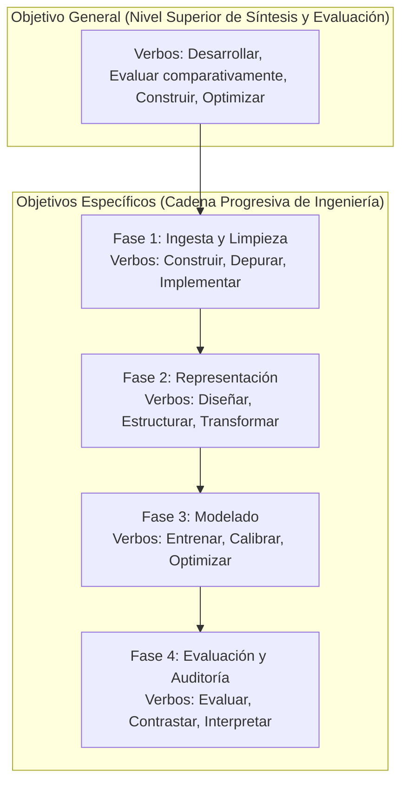

# Marco Metodológico Teórico: Formulación de Objetivos en Inteligencia Artificial y Ciencia de Datos

Este documento define de forma abstracta, conceptual y formal los marcos metodológicos empleados para estructurar el **Objetivo General** y los **Objetivos Específicos** en proyectos de investigación aplicada e ingeniería de **Aprendizaje Automático**, **sin descender aún al caso de estudio particular**.

---

## 1. El Marco SMART de Operacionalización de Objetivos

El marco **SMART** (*Specific, Measurable, Achievable, Relevant, Time-bound*) establece los criterios de calidad que un objetivo debe satisfacer para considerarse científicamente válido y gestionable:

```text
┌────────────────────────────────────────────────────────────────────────┐
│                      CRITERIOS DEL MARCO SMART EN IA                   │
├─────────┬──────────────────────┬───────────────────────────────────────┤
│ Dimensión│ Definición Teórica   │ Criterio de Cumplimiento en IA        │
├─────────┼──────────────────────┼───────────────────────────────────────┤
│ S       │ Specific             │ Debe definir con precisión la tarea   │
│         │ (Específico)         │ técnica, el tipo de modelo y los datos│
│         │                      │ sin ambigüedad conceptual.            │
├─────────┼──────────────────────┼───────────────────────────────────────┤
│ M       │ Measurable           │ Debe estar asociado a funciones de    │
│         │ (Medible)            │ pérdida y métricas cuantitativas      │
│         │                      │ verificables (F1, Recall, PR-AUC).    │
├─────────┼──────────────────────┼───────────────────────────────────────┤
│ A       │ Achievable           │ Debe ser factible dentro de los límites│
│         │ (Alcanzable)         │ de cómputo, datos y tiempo del estudio│
├─────────┼──────────────────────┼───────────────────────────────────────┤
│ R       │ Relevant             │ Debe responder directamente a la falla│
│         │ (Relevante)          │ identificada en el diagnóstico inicial│
├─────────┼──────────────────────┼───────────────────────────────────────┤
│ T       │ Time-bound           │ Debe estar delimitado en un horizonte │
│         │ (Temporal)           │ temporal de evaluación explícito.     │
└─────────┴──────────────────────┴───────────────────────────────────────┘
```

---

## 2. Taxonomía de Bloom Aplicada a la Ingeniería de Machine Learning

La **Taxonomía de Bloom** clasifica los procesos cognitivos y de ingeniería en una jerarquía acumulativa de niveles de complejidad. En un proyecto de Inteligencia Artificial, la elección de los **verbos de acción** debe reflejar rigurosamente esta jerarquía:



* **Regla Metodológica:** Los objetivos específicos no son una lista arbitraria de tareas administrativas; representan los **hitos técnicos indispensables y secuenciales** requeridos para alcanzar el objetivo general.

---

## 3. Coherencia Espejo del Marco Lógico (Árbol de Problemas $\leftrightarrow$ Árbol de Objetivos)

En la metodología de Marco Lógico (CEPAL / BID), el planteamiento de objetivos se fundamenta en el **principio de coherencia especular**:

$$\text{Causas Raíz del Árbol de Problemas } \xrightarrow{\text{Inversión Positiva}} \text{ Medios / Objetivos Específicos}$$
$$\text{Problema Central } \xrightarrow{\text{Inversión Positiva}} \text{ Propósito / Objetivo General}$$
$$\text{Efectos Negativos } \xrightarrow{\text{Inversión Positiva}} \text{ Fines / Impactos Esperados}$$

### Regla de Mapeo Biunívoco:
Por cada causa estructural identificada en el diagnóstico del problema debe existir exactamente un objetivo específico destinado a mitigarla o resolverla. Si existe un objetivo que no responde a una causa identificada, es un objetivo espurio; si existe una causa sin objetivo, el sistema deja un vacío metodológico.

---

## 4. El Marco de Ciclo de Vida CRISP-DM para Proyectos de IA

Para asegurar la coherencia en ingeniería de software y datos, los objetivos específicos se alinean con las fases estándar del modelo **CRISP-DM** (*Cross-Industry Standard Process for Data Mining*):

1. **Comprensión y Preparación de Datos (*Data Preparation*):** Automatización del flujo de datos, resolución de datos faltantes estructurales, control de consistencia de tipos y aserciones de calidad.
2. **Ingeniería de Características (*Feature Engineering*):** Transformación del espacio de entrada, agregación relacional entre niveles de granularidad dispares y mitigación de dispersión en variables categóricas.
3. **Modelado y Optimización (*Modeling*):** Entrenamiento de algoritmos supervisados de complejidad creciente (baselines vs. ensambles) e incorporación de funciones de costo adaptadas a la asimetría del problema.
4. **Evaluación y Explicabilidad (*Evaluation & Interpretability*):** Validación experimental estricta sobre particiones fuera de tiempo, análisis de significancia estadística y atribución explicable de predicciones para auditoría algorítmica.
