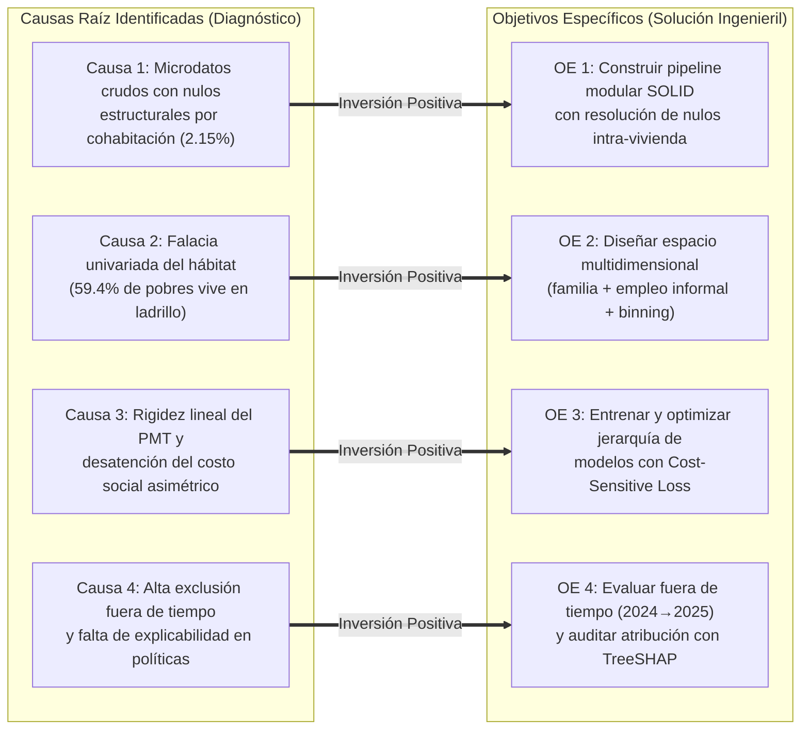

# Metodología Aplicada: Formulación de Objetivos del Proyecto

Este documento aterriza los marcos metodológicos abstractos (SMART, Taxonomía de Bloom, Coherencia Espejo del Marco Lógico y CRISP-DM) al proyecto de **clasificación supervisada de pobreza urbana en Lima Metropolitana y Callao utilizando microdatos de la ENAHO**, adaptado a la **rúbrica y alcance del curso de Inteligencia Artificial (1INF24 - PUCP)**.

---

## 1. Matriz SMART Aplicada a los Objetivos del Proyecto

```text
┌────────────────────────────────────────────────────────────────────────────────────────────────────────┐
│                          MATRIZ SMART APLICADA AL SISTEMA DE CLASIFICACIÓN                             │
├─────────┬──────────────────────────────────────────────────────────────────────────────────────────────┤
│ SPECIFIC│ Desarrollar y evaluar comparativamente un clasificador binario supervisado que distinga       │
│         │ hogares pobres (y = 1) de no pobres (y = 0) en Lima y Callao usando microdatos ENAHO         │
│         │ (Módulos 01, 02, 03, 05 y 34), contrastando Regresión Logística, CART, Random Forest y GBDT.  │
├─────────┼──────────────────────────────────────────────────────────────────────────────────────────────┤
│ MEASUR. │ El éxito se evalúa mediante F1-score en la clase minoritaria (mejora esperada ≥ 15 pp sobre │
│         │ el baseline), Recall de pobreza ≥ 80% (reducción del error de exclusión por debajo del 20%) │
│         │ y ganancia en PR-AUC ≥ 0.12 puntos.                                                          │
├─────────┼──────────────────────────────────────────────────────────────────────────────────────────────┤
│ ACHIEV. │ Factible computacionalmente en Python (scikit-learn, LightGBM) utilizando las muestras       │
│         │ oficiales de 2024 y 2025 ya descargadas y limpiadas (11,160 hogares) en hardware estándar.   │
├─────────┼──────────────────────────────────────────────────────────────────────────────────────────────┤
│ RELEV.  │ Resuelve la limitación de los modelos lineales del SISFOH (MCO) y aborda el problema de los   │
│         │ 739 hogares pobres "invisibles" (71.26% sin transferencias públicas en Lima y Callao).       │
├─────────┼──────────────────────────────────────────────────────────────────────────────────────────────┤
│ TIME-B. │ Diseñado para el ciclo académico 2026-2 y evaluado experimentalmente en una partición fuera │
│         │ de tiempo estricta: Entrenamiento en ENAHO 2024 y prueba ciega en ENAHO 2025.               │
└─────────┴──────────────────────────────────────────────────────────────────────────────────────────────┘
```

---

## 2. Coherencia Espejo: Mapeo de Causas Raíz a Objetivos Específicos

En cumplimiento del principio de Marco Lógico, cada Objetivo Específico es la contraparte directa que resuelve una causa raíz identificada en el diagnóstico del problema:



---

## 3. Formulación Formal de Objetivos

### Objetivo General
> **"Desarrollar, entrenar y evaluar comparativamente un sistema de clasificación binaria supervisado basado en modelos de árboles de decisión (CART, Random Forest y Gradient Boosting), integrando microdatos multidimensionales de vivienda, composición familiar y empleo informal de la ENAHO, para optimizar la identificación de hogares en condición de pobreza monetaria y reducir asimétricamente el error de exclusión social en Lima Metropolitana y el Callao bajo una evaluación temporal fuera de tiempo (2024 $\to$ 2025)."**

---

### Objetivos Específicos

#### Objetivo Específico 1 (Ingesta y Limpieza Modular de Datos)
* **Verbo de Bloom:** *Construir e implementar* (Nivel de Aplicación e Ingeniería).
* **Fase CRISP-DM:** *Data Understanding & Data Preparation*.
* **Enunciado:** Construir e implementar un pipeline modular de datos bajo principios SOLID y el patrón *Template Method* en Python que automatice la ingestión, autodetección de delimitadores (`,` y `;`), filtrado geográfico para Lima y Callao (UBIGEO 07 y 15) y la resolución de nulos estructurales por cohabitación intra-vivienda en los módulos 01, 02, 03, 05 y 34 de la ENAHO, garantizando un 0% de valores faltantes y consistencia relacional de llaves primarias.
* **Criterio Cuantitativo de Éxito:** Generación automatizada de datasets consolidados limpios para 2024 y 2025 con 11,160 registros de hogares validados sin pérdida de cobertura.

#### Objetivo Específico 2 (Ingeniería de Características y Representación Multidimensional)
* **Verbo de Bloom:** *Diseñar y estructurar* (Nivel de Análisis y Creación).
* **Fase CRISP-DM:** *Feature Engineering*.
* **Enunciado:** Diseñar y estructurar operadores de agregación relacional a nivel de hogar ($\text{individuo} \to \text{hogar}$) para incorporar proxies de composición demográfica familiar (Módulo 02: razón de dependencia, niños menores de 5 años), capital humano (Módulo 03: años de educación del jefe) y precariedad laboral (Módulo 05: condición de informalidad sin derechos), aplicando técnicas de agrupación semántica (*Domain-based Binning*) sobre variables habitacionales para mitigar la alta cardinalidad sin destruir la señal socioeconómica.
* **Criterio Cuantitativo de Éxito (vinculado a $H_1$):** El espacio multidimensional integrado debe aportar un incremento en PR-AUC $\ge 0.12$ puntos respecto al espacio limitado únicamente a variables habitacionales del Módulo 01.

#### Objetivo Específico 3 (Modelado y Optimización con Pérdida Asimétrica)
* **Verbo de Bloom:** *Entrenar y optimizar* (Nivel de Síntesis y Optimización).
* **Fase CRISP-DM:** *Modeling*.
* **Enunciado:** Entrenar y optimizar la jerarquía de modelos de clasificación supervisada enseñados en el curso de Inteligencia Artificial (Regresión Logística como baseline lineal, Árbol de Decisión CART, Random Forest y Gradient Boosting / LightGBM), calibrando funciones de pérdida sensibles al costo (*Cost-Sensitive Loss*) mediante una ponderación asimétrica ($c_1 / c_0 \approx 4.37$) para penalizar con mayor severidad los Falsos Negativos (hogares pobres excluidos) sobre los Falsos Positivos.
* **Criterio Cuantitativo de Éxito (vinculado a $H_2$ y $H_3$):** Lograr una reducción de Falsos Negativos $\ge 35\%$ con precisión $\ge 60\%$, y demostrar la superioridad estadística de los ensambles sobre el modelo lineal con una ventaja $\ge 10$ puntos porcentuales en $F_1$-score ($p < 0.05$).

#### Objetivo Específico 4 (Evaluación Experimental y Auditoría de Explicabilidad)
* **Verbo de Bloom:** *Evaluar y auditar* (Nivel de Evaluación Crítica).
* **Fase CRISP-DM:** *Evaluation & Interpretability*.
* **Enunciado:** Evaluar el desempeño de los modelos clasificados en un protocolo experimental estricto fuera de tiempo (*Train 2024 $\to$ Test 2025*) mediante métricas adaptadas al desbalance de clases ($F_1$-score, Recall, PR-AUC), auditando la atribución de importancia e interacciones no lineales de las variables mediante valores de Shapley (TreeSHAP) para garantizar la interpretabilidad y equidad ética del sistema.
* **Criterio Cuantitativo de Éxito (vinculado a $H_4$):** Demostrar una retención de al menos el 85% del puntaje $F_1$ en la evaluación ciega de 2025 respecto al entrenamiento de 2024, identificando los factores que explican la exclusión social de los hogares.
