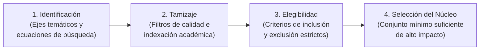

# Marco Metodológico Teórico: Revisión Sistemática de Literatura y Benchmark Científico

Este documento define de forma abstracta, conceptual y formal las metodologías empleadas para **identificar, seleccionar, clasificar y evaluar críticamente la literatura científica** en proyectos de **Inteligencia Artificial y Ciencia de Datos**, **sin descender aún al caso de estudio particular**.

---

## 1. El Protocolo de Revisión Sistemática (Adaptación PRISMA / Kitchenham)

En ciencias computacionales e ingeniería de software, la revisión de la literatura no se realiza por conveniencia o búsqueda dispersa, sino siguiendo protocolos estructurados derivados del estándar **PRISMA** (*Preferred Reporting Items for Systematic Reviews and Meta-Analyses*) y las directrices de **Kitchenham & Charters (2007)**:



1. **Definición de Ejes Temáticos:** La búsqueda se descompone en tres dimensiones indispensables:
   * *Eje de Dominio:* Publicaciones sobre el problema de impacto social o económico específico.
   * *Eje Algorítmico:* Publicaciones sobre las arquitecturas de modelos de aprendizaje supervisado sobre el tipo de dato objetivo (tabular, relacional, secuencial).
   * *Eje de Evaluación:* Publicaciones sobre protocolos de prueba, asimetría de pérdidas y explicabilidad.
2. **Jerarquía de Indexación:** Se priorizan fuentes arbitradas por pares (*peer-review*) en cuartiles superiores (Scopus Q1/Q2, Web of Science) y conferencias rankeadas en CORE A/A* (NeurIPS, ICML, KDD, ACM).

---

## 2. Tipología Epistemológica de Fuentes: Primarias vs. Secundarias

Para mantener una rigurosa trazabilidad del conocimiento, se distingue formalmente entre fuentes primarias y secundarias tanto en el ámbito de **datos** como en el de **literatura**:

```text
┌────────────────────────────────────────────────────────────────────────────────────────────────────────┐
│                              TAXONOMÍA FORMAL DE FUENTES EN INVESTIGACIÓN DE IA                        │
├──────────────┬──────────────────────────────────────────┬──────────────────────────────────────────────┤
│ ÁMBITO       │ FUENTE PRIMARIA (Origen Directo)         │ FUENTE SECUNDARIA (Síntesis / Meta-Análisis) │
├──────────────┼──────────────────────────────────────────┼──────────────────────────────────────────────┤
│ 1. Datos     │ Registros directos observados y medidos  │ Informes con datos agregados, resúmenes      │
│              │ de la realidad sin transformaciones de   │ estadísticos, proyecciones o indicadores     │
│              │ terceros (microdatos crudos a nivel de   │ consolidados por organismos intermedios      │
│              │ unidad individual u hogar).              │ (ej. compendios anuales de cifras).          │
├──────────────┼──────────────────────────────────────────┼──────────────────────────────────────────────┤
│ 2. Literatura│ Artículos de investigación original donde│ Revisiones sistemáticas, meta-análisis,      │
│    Científica│ los propios autores concibieron,         │ marcos regulatorios y libros de texto que    │
│              │ desarrollaron y probaron empíricamente   │ recopilan, comparan o sintetizan decenas de  │
│              │ el algoritmo, teoría o experimento.      │ investigaciones primarias previas.           │
└──────────────┴──────────────────────────────────────────┴──────────────────────────────────────────────┘
```

---

## 3. Criterios Metodológicos de Inclusión y Exclusión

La selección de publicaciones se rige por un conjunto no ambiguo de reglas booleanas:

### Criterios de Inclusión (Inclusion Criteria - IC):
* **IC1 (Rigor de Publicación):** Publicado en revistas indexadas con revisión por pares o actas de conferencias de primer nivel internacional.
* **IC2 (Temporalidad):** Equilibrio entre referencias fundacionales clásicas y un núcleo mayoritario contemporáneo (publicado en los últimos 2 a 4 años) que capture los avances técnicos y coyunturas recientes.
* **IC3 (Relevancia Empírica):** Estudios que incluyan experimentación reproducible sobre conjuntos de datos reales de complejidad equivalente, reportando métricas cuantitativas formales.

### Criterios de Exclusión (Exclusion Criteria - EC):
* **EC1 (Falta de Arbitraje):** Artículos de blogs, repositorios informales de divulgación o publicaciones sin revisión formal por pares.
* **EC2 (Desconexión de Dominio):** Estudios enfocados exclusivamente en tipos de datos no análogos (ej. procesamiento de lenguaje natural o visión computacional pura) cuyas conclusiones no apliquen a datos tabulares heterogéneos.
* **EC3 (Opacidad Metodológica):** Trabajos que no detallen su protocolo experimental, funciones de pérdida o esquema de partición de datos.

---

## 4. La Matriz de Contribución Dual: Teórica vs. Técnica

Para que un trabajo relacionado justifique su inclusión en el informe, debe evaluarse bajo la **Matriz de Contribución Dual**:

$$\text{Aporte del Trabajo} = \langle \text{Contribución Teórica}, \text{Contribución Técnica} \rangle$$

1. **Contribución Teórica (El "Por Qué Conceptual"):**
   * Justifica la validez de los supuestos del estudio.
   * Explica los mecanismos causales y sesgos inductivos (*inductive biases*) de los modelos.
   * Sustenta por qué ciertos enfoques tradicionales fallan teóricamente (ej. sobreajuste dentro de muestra o colapso del supuesto de linealidad aditiva).
2. **Contribución Técnica (El "Cómo Algorítmico"):**
   * Aporta operadores computacionales, formulaciones matemáticas de funciones de pérdida o arquitecturas algorítmicas adoptadas directamente en el código.
   * Proporciona protocolos experimentales reproducibles (ej. esquemas de validación temporal fuera de tiempo) y métricas idóneas para el tipo de distribución de datos.

---

## 5. El Principio de Selección del Núcleo Crítico (*Parsimony Principle*)

En la redacción científica bajo límites estrictos de páginas, incluir un listado indiscriminado de 10 o 15 publicaciones genera **saturación bibliográfica y superficialidad analítica**. 

El principio de parsimonia metodológica exige seleccionar un **Núcleo Crítico Mínimo Suficiente (3 a 5 publicaciones)** que:
* Cubra integralmente los pilares del problema (dominio social, algoritmo tabular, protocolo de validación y asimetría de pérdidas).
* Permita un análisis comparativo profundo en lugar de una mera enumeración superficial.
* Mantenga el informe dentro del presupuesto editorial del entregable.
