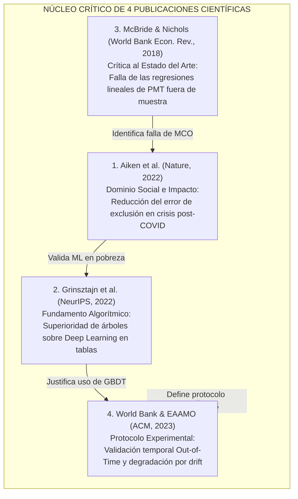

# Metodología Aplicada: Benchmark y Selección de Literatura Científica

> **⚠️ Nota (Plan 2, 2026-10-08):** este documento conserva textos anteriores al levantamiento de observaciones (alcance de 5,571 hogares, matriz `INGTPUHD`, hipótesis previas, atribuciones de papers sin verificar). La versión vigente es la de los archivos `.tex` y la de [`Observaciones a levantar/Plan 2`](../../Observaciones%20a%20levantar/Plan%202/README.md).

Este documento aplica los marcos metodológicos abstractos (protocolo de revisión sistemática, tipología de fuentes, matriz de contribución dual y principio de parsimonia) al proyecto de **clasificación de pobreza en Lima Metropolitana y Callao con la ENAHO**, adaptado a los requerimientos del curso de **Inteligencia Artificial (1INF24 - PUCP)**.

---

## 1. Identificación y Clasificación de Fuentes del Proyecto

Para garantizar máxima transparencia epistemológica, se clasifican las fuentes del proyecto según su tipología primaria o secundaria:

```text
┌────────────────────────────────────────────────────────────────────────────────────────────────────────┐
│                      MAPA DE FUENTES PRIMARIAS Y SECUNDARIAS DEL PROYECTO                              │
├──────────────┬──────────────────────────────────────────┬──────────────────────────────────────────────┤
│ ÁMBITO       │ FUENTES PRIMARIAS (Origen Empírico)      │ FUENTES SECUNDARIAS (Contexto y Síntesis)    │
├──────────────┼──────────────────────────────────────────┼──────────────────────────────────────────────┤
│ 1. Datos del │ • Microdatos oficiales de la ENAHO       │ • Informes Técnicos Anuales del INEI         │
│    Estudio   │   (INEI, 2024 y 2025):                   │   (Pobreza Monetaria 2015-2024: 28.2%).      │
│              │   - Enaho01-YYYY-100.csv (Vivienda)      │ • Compendios sociológicos de GRADE (2024)    │
│              │   - Enaho01-YYYY-200.csv (Demografía)    │   sobre autoconstrucción informal en Lima.   │
│              │   - Enaho01A-YYYY-300.csv (Educación)    │ • Diagnósticos de vulnerabilidad del IEP     │
│              │   - Enaho01a-YYYY-500.csv (Empleo)       │   (Trivelli, 2023) sobre canasta y ollas.    │
│              │   - Sumaria-YYYY.csv (Pobreza y Target)  │ • Informes regionales de la CEPAL (2023)     │
│              │   (11,160 registros crudos de hogares).  │   sobre trabajadores pobres e informalidad.  │
├──────────────┼──────────────────────────────────────────┼──────────────────────────────────────────────┤
│ 2. Literatura│ • Artículos de investigación original    │ • Revisiones sistemáticas y reportes marcos: │
│    Científica│   donde los autores validaron el método: │   - World Bank (2024): "Machine Learning for │
│              │   - Aiken et al. (Nature, 2022)          │     Poverty Targeting: Promise and Perils".  │
│              │   - Grinsztajn et al. (NeurIPS, 2022)    │   - Fernández et al. (JAIR, 2018):           │
│              │   - McBride & Nichols (World Bank, 2018) │     Revisión de 15 años de desbalance y SMOTE│
│              │   - World Bank EAAMO (ACM, 2023)         │   - Molnar (2022): Handbook de Interpretable │
│              │   - Lundberg & Lee (NeurIPS, 2017)       │     Machine Learning.                        │
└──────────────┴──────────────────────────────────────────┴──────────────────────────────────────────────┘
```

---

## 2. Aplicación de la Matriz de Contribución Dual (Teórica vs. Técnica)

Se evaluaron siete publicaciones científicas candidatas bajo el criterio de contribución dual antes de proceder a la selección del núcleo:

```text
┌─────────────────────────────────────────────────────────────────────────────────────────────────────────────────────────────────────────┐
│                                           MATRIZ COMPLETA DE BENCHMARK CIENTÍFICO                                                       │
├──────────────────────────┬─────────────────────────────────────────────────┬────────────────────────────────────────────────────────────┤
│ PUBLICACIÓN              │ CONTRIBUCIÓN TEÓRICA (El "Por Qué")             │ CONTRIBUCIÓN TÉCNICA (El "Cómo")                           │
├──────────────────────────┼─────────────────────────────────────────────────┼────────────────────────────────────────────────────────────┤
│ 1. Aiken et al. (2022)   │ Demuestra que los padrones estatales estáticos  │ Inferencia sobre proxies observables de encuestas para     │
│    Revista: Nature       │ fallan ante crisis post-pandemia y que el ML    │ priorizar transferencias de emergencia sin solicitar       │
│    (Oxford / Berkeley)   │ reduce el error de exclusión en un 4% a 21%.    │ ingresos declarados inobservables.                         │
├──────────────────────────┼─────────────────────────────────────────────────┼────────────────────────────────────────────────────────────┤
│ 2. Grinsztajn et al.     │ Explica por qué el sesgo inductivo de redes     │ Benchmark en 45 datasets que prueba la superioridad de     │
│    (2022)                │ neuronales (smoothness bias) fracasa en tablas; │ Gradient Boosted Trees (LightGBM, XGBoost, Random Forest)  │
│    NeurIPS 2022          │ los árboles modelan funciones escalonadas no    │ sobre arquitecturas Deep Learning (MLP, ResNet, TabNet)   │
│                          │ suaves óptimas para variables de encuestas.     │ en datos tabulares de tamaño medio heterogéneos.           │
├──────────────────────────┼─────────────────────────────────────────────────┼────────────────────────────────────────────────────────────┤
│ 3. McBride & Nichols     │ Prueba que el PMT lineal por MCO tradicional    │ Demuestra que los ensambles basados en árboles reducen el  │
│    (2018)                │ sufre de sobreajuste en muestra y colapsa fuera │ error de exclusión social entre 10% y 18% fuera de muestra │
│    World Bank Econ. Rev. │ de muestra al asumir aditividad independiente.  │ frente a las regresiones lineales que usan los gobiernos.  │
├──────────────────────────┼─────────────────────────────────────────────────┼────────────────────────────────────────────────────────────┤
│ 4. World Bank & EAAMO    │ Formaliza el concepto de degradación temporal   │ Protocolo de partición temporal fuera de tiempo            │
│    (2023)                │ (out-of-time dataset drift) en modelos de       │ (Entrenamiento en año t → Prueba ciega en año t+1) para    │
│    ACM Conference        │ pobreza urbana frente a inflación y shocks.     │ evitar fuga de datos (data leakage) y medir deriva real.   │
├──────────────────────────┼─────────────────────────────────────────────────┼────────────────────────────────────────────────────────────┤
│ 5. Elkan (2001) /        │ Demuestra que minimizar error simétrico es      │ Función de pérdida asimétrica (Cost-Sensitive Loss):       │
│    Fernández et al.(2018)│ subóptimo ante costos dispares (CFN >> CFP).    │ c1/c0 ≈ (1-π)/π y calibración del umbral de decisión (τ)   │
│    IJCAI / JAIR          │ Desaconseja SMOTE en datos tabulares densos.    │ en lugar de técnicas de sobremuestreo sintético ruidoso.   │
├──────────────────────────┼─────────────────────────────────────────────────┼────────────────────────────────────────────────────────────┤
│ 6. Lundberg et al.(2020) │ Resuelve la objeción ética de "caja negra" con  │ Algoritmo TreeSHAP de complejidad polinomial O(TLD²) para  │
│    Nature Machine Intell.│ valores de Shapley axiomáticamente consistentes │ calcular la atribución local exacta de cada variable       │
│    (Explicabilidad XAI)  │ (eficiencia, simetría y aditividad local).      │ socioeconómica por hogar sin aproximaciones estocásticas.  │
├──────────────────────────┼─────────────────────────────────────────────────┼────────────────────────────────────────────────────────────┤
│ 7. GRADE (2024) /        │ Desmitifican la autoconstrucción (el 59% de     │ Criterio de selección de features: descartar el ingreso y  │
│    IEP (Trivelli, 2023)  │ pobres vive en ladrillo) y la "pobreza urbana   │ priorizar hacinamiento, agua por cisterna, carga de        │
│    (Ciencias Sociales)   │ cara" (agua en cisterna 6x más cara, comida 100%│ dependencia demográfica e informalidad ocupacional.        │
└──────────────────────────┴─────────────────────────────────────────────────┴────────────────────────────────────────────────────────────┘
```

---

## 3. Selección Justificada del Núcleo Crítico (4 Publicaciones Centrales)

Siguiendo el principio de parsimonia y para **evitar la saturación del informe (respetando el límite estricto de 4 páginas del entregable parcial)**, se selecciona un **núcleo estratégico de cuatro publicaciones primarias de máximo prestigio internacional**:



### Justificación de la Selección:
1. **Aiken et al. (*Nature*, 2022):** Publicado en la revista científica más prestigiosa del mundo. Respalda la aplicación de Machine Learning para focalizar ayuda social y reducir asimétricamente el error de exclusión en contextos post-pandemia.
2. **Grinsztajn et al. (*NeurIPS*, 2022):** Publicado en la conferencia cúspide de Inteligencia Artificial. Brinda la justificación matemática y empírica indiscutible de por qué los ensambles de árboles (CART, Random Forest, GBDT/LightGBM) superan a las redes neuronales profundas en datos tabulares de encuestas.
3. **McBride & Nichols (*The World Bank Economic Review*, 2018):** Estudio seminal del Banco Mundial que demuestra con datos de países en desarrollo por qué los modelos paramétricos lineales (como el SISFOH en Perú) fracasan fuera de muestra y por qué los modelos no lineales basados en árboles son superiores.
4. **World Bank & EAAMO (*ACM Conference*, 2023):** Conferencia especializada en equidad y algoritmos. Fundamenta técnicamente la necesidad de evaluar los modelos de pobreza en esquemas ciegos fuera de tiempo (*out-of-time 2024 $\to$ 2025*) para medir su robustez ante inflación y desplazamiento de distribución.

*(Nota Metodológica: Las publicaciones complementarias de Elkan y Fernández sobre desbalance, Lundberg sobre TreeSHAP, y los estudios de GRADE/IEP se integran en la metodología técnica y en las referencias bibliográficas IEEE del informe sin recargar la narrativa de Trabajos Relacionados).*

---

## 4. Cuadro Comparativo Multidimensional del Núcleo Crítico

```text
┌────────────────────────────────────────────────────────────────────────────────────────────────────────────────────────┐
│                              CUADRO COMPARATIVO MULTIDIMENSIONAL DE ENFOQUES CIENTÍFICOS                               │
├────────────────────┬──────────────────────┬──────────────────────┬──────────────────────┬──────────────────────────────┤
│ DIMENSIÓN          │ McBride & Nichols    │ Aiken et al.         │ Grinsztajn et al.    │ NUESTRO ENFOQUE              │
│                    │ (World Bank, 2018)   │ (Nature, 2022)       │ (NeurIPS, 2022)      │ (ENAHO ML Tabular PUCP)      │
├────────────────────┼──────────────────────┼──────────────────────┼──────────────────────┼──────────────────────────────┤
│ Tipo de Algoritmo  │ Lasso, Ridge, Random │ Gradient Boosting y  │ Benchmark de GBDT vs │ Jerarquía del curso: Regres. │
│                    │ Forest, GBDT         │ Redes Neuronales     │ Deep Learning (45 ds)│ Logística, CART, RF y GBDT   │
├────────────────────┼──────────────────────┼──────────────────────┼──────────────────────┼──────────────────────────────┤
│ Tipo de Datos      │ Encuestas de hogares │ Metadatos móviles +  │ Datos tabulares      │ Microdatos ENAHO multimodular│
│                    │ de países en desarro.│ imágenes satelitales │ heterogéneos mixtos  │ (Vivienda + Familia + Empleo)│
├────────────────────┼──────────────────────┼──────────────────────┼──────────────────────┼──────────────────────────────┤
│ Tratamiento del    │ Corte arbitrario de  │ Umbral calibrado por │ Evaluación estándar  │ Función de costo asimétrica  │
│ Desbalance         │ percentil de pobreza │ cuota presupuestal   │ balanceada / AUC     │ (CFN >> CFP) + Umbral óptimo │
├────────────────────┼──────────────────────┼──────────────────────┼──────────────────────┼──────────────────────────────┤
│ Esquema de         │ Validación cruzada   │ Validación espacial  │ K-Fold estratificado │ Validación temporal ciega    │
│ Validación         │ estándar k-fold      │ geográfica           │ aleatorio            │ Out-of-Time (2024 → 2025)    │
├────────────────────┼──────────────────────┼──────────────────────┼──────────────────────┼──────────────────────────────┤
│ Explicabilidad     │ Importancia global   │ Coeficientes y pesos │ Análisis de sesgo    │ TreeSHAP (valores de Shapley │
│                    │ de variables (MDI)   │ de características   │ inductivo teórico    │ exactos por hogar)           │
└────────────────────┴──────────────────────┴──────────────────────┴──────────────────────┴──────────────────────────────┘
```
