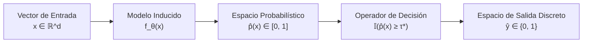

# Metodología Teórica: Comportamiento Entrada/Salida en Sistemas de Aprendizaje Tabular

Este documento formaliza el marco teórico y los contratos de interfaz que gobiernan el espacio de entrada, el espacio de salida y las restricciones de preservación causal en sistemas de aprendizaje automático supervisado sobre datos tabulares heterogéneos.

---

## 1. Definición Formal del Espacio de Entrada ($\mathcal{X}$)

El espacio de entrada corresponde a un dominio estructurado heterogéneo $\mathcal{X} = \mathcal{X}_1 \times \mathcal{X}_2 \times \dots \times \mathcal{X}_d$, donde cada instancia se representa mediante un vector de características:
$$\mathbf{x} = [x_1, x_2, \dots, x_d]^T \in \mathbb{R}^d$$

En datos tabulares complejos, los atributos exhiben naturalezas matemáticas disímiles:
1. **Variables Numéricas Continuas / Racionales ($\mathcal{X}_j \subseteq \mathbb{R}$):** Medidas continuas de magnitud o intensidad.
2. **Variables Discretas de Conteo ($\mathcal{X}_j \subseteq \mathbb{N}_0$):** Cantidades enteras no negativas resultantes de agregación.
3. **Variables Categóricas Ordinales ($\mathcal{X}_j = \{c_1 \prec c_2 \prec \dots \prec c_k\}$):** Niveles con una relación de orden natural estricta.
4. **Variables Categóricas Nominales ($\mathcal{X}_j = \{u_1, u_2, \dots, u_m\}$):** Clases sin relación métrica ni jerárquica.

### Contrato de Representación Vectorial y Métricas de Asociación
Para garantizar la compatibilidad con modelos lineales y optimizadores de gradiente, las variables nominales deben ser transformadas mediante operadores de codificación semántica o indicatriz $\psi: \mathcal{X}_j \to \{0, 1\}^m$, mientras que los modelos basados en particiones arbóreas requieren preservación de la ordinalidad natural para evaluar cortes univariados de la forma $\mathbb{I}(x_j \le \theta)$.

En datos tabulares heterogéneos, la correlación de Pearson clásica ($r$) resulta matemáticamente inaplicable para variables nominales u ordinales al imponer una métrica euclidiana artificial. Se formalizan dos métricas teóricas de asociación:
1. **Asociación Nominal Inter-Covariable (V de Cramér):** Cuantifica el grado de dependencia no direccional entre pares de variables categóricas $X_j$ y $X_k$ a partir del estadístico $\chi^2$:
   $$V(X_j, X_k) = \sqrt{\frac{\chi^2}{N \cdot \min(r - 1, c - 1)}} \in [0, 1]$$
   utilizada como criterio de poda de multicolinealidad estructural ($V > 0.80$).
2. **Dependencia Generalizada con el Target (Información Mutua):** Mide la reducción de entropía de Shannon $H(Y)$ inducida por el conocimiento de $X_j$, sin asumir linealidad ni continuidad:
   $$I(X_j; Y) = \iint p(x, y) \log \frac{p(x, y)}{p(x)p(y)} \, dx \, dy \ge 0$$

### Reducción de Dimensionalidad: Selección Curada vs. Proyección Factorial (PCA/FAMD)
El sistema rechaza la proyección factorial continua (PCA o FAMD) sobre la totalidad de la matriz tabular. Dicha rotación ortogonal transforma variables categóricas dispersas en combinaciones lineales densas, lo cual: (i) degrada el sesgo inductivo de los clasificadores basados en árboles (CART, Random Forest, LightGBM), cuya eficiencia radica en particiones ortogonales univariadas alineadas a los ejes; y (ii) anula la interpretabilidad de políticas públicas requerida por la metodología (e.g., valores de atribución local TreeSHAP). Por tanto, la reducción dimensional se implementa formalmente mediante un proceso de **Selección y Curaduría de Características (*Feature Selection*) en tres etapas** guiado por el diagnóstico exploratorio inicial, reduciendo el espacio de $d_{\text{raw}} > 400$ a un subespacio óptimo $\mathcal{X} \subset \mathbb{R}^{d_{\text{curado}}}$ con $d \approx 20$.

---

## 2. Principio Estricto de Cero Fuga de Información (*Zero Data Leakage*)

El espacio de entrada $\mathcal{X}$ debe satisfacer el **Principio de Aislamiento Exógeno**. Se define formalmente una variable $Z$ como *fuga de información* (*data leak*) si cumple cualquiera de las siguientes condiciones:

1. **Fuga por Proxy del Target (Endogeneidad Directa):**  
   $$I(Z; Y) \to H(Y) \quad \text{y} \quad Z \text{ no está disponible en tiempo de inferencia real}$$
   Cualquier variable que represente una medición directa, un componente algebraico de la fórmula de definición de la etiqueta o un derivado temporal posterior a la ocurrencia del evento clasificado debe ser matemáticamente excluida de $\mathcal{X}$.

2. **Fuga Temporal (*Temporal Leakage*):**  
   Ocurre cuando información del periodo $t > t_{\text{train}}$ se utiliza durante el preprocesamiento, imputación o escalamiento de las variables de entrenamiento, violando la causalidad temporal.

---

## 3. Definición Formal del Espacio de Salida ($\mathcal{Y}$)

El sistema exhibe un comportamiento de salida dual que desacopla la estimación de creencia continua de la regla de decisión determinista:

1. **Salida Continua / Probabilística:**
   $$s(\mathbf{x}) = \hat{p}(\mathbf{x}) \in [0, 1]$$
   donde $\hat{p}(\mathbf{x})$ representa la probabilidad posterior o grado de confianza de que la instancia pertenezca a la clase positiva. Requiere consistencia y buena calibración evaluada mediante curvas de confiabilidad (*reliability diagrams*).

2. **Salida Discreta / Operativa:**
   $$\hat{y} = \mathbb{I}(\hat{p}(\mathbf{x}) \ge \tau^*) \in \{0, 1\}$$
   donde $\tau^*$ es el umbral de corte óptimo calibrado bajo la función de costo asimétrica del decisor.
