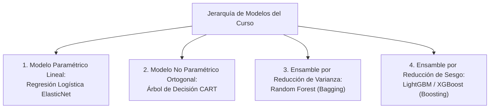

# Metodología Teórica: Operadores de Preparación y Algoritmos Adaptados

Este documento formaliza la fundamentación matemática y teórica de los operadores de transformación de microdatos y las adaptaciones algorítmicas implementadas en el pipeline de aprendizaje supervisado.

---

## 1. Operadores Matemáticos de Transformación de Datos

### 1.1 Operador de Propagación Jerárquica Intra-Cluster ($\mathcal{O}_{\text{cluster}}$)
En estructuras de datos jerárquicas o anidadas donde unidades secundarias comparten un contenedor físico con una unidad primaria pero sufren de ausencia sistemática de mediciones contextuales, la imputación por la media o moda global distorsiona la distribución condicional.
Se define el operador de propagación intra-cluster condicional al identificador de contenedor $\kappa \in \mathcal{K}$:
$$\mathcal{O}_{\text{cluster}}(z_{ij}) = \begin{cases}
z_{ij} & \text{si } z_{ij} \neq \emptyset \\
z_{i1} & \text{si } z_{ij} = \emptyset \land z_{i1} \neq \emptyset \\
\text{mode}_{\kappa}(z) & \text{en otro caso}
\end{cases}$$
donde $j$ indica el orden de la subunidad dentro del contenedor $i$. Este operador preserva las propiedades invariantes del entorno físico compartido.

### 1.2 Operador de Agregación Multinivel Relacional ($\Phi$)
Cuando los datos observacionales poseen una relación de cardinalidad $1:M$ (una unidad de análisis contiene $M_i$ subentidades individuales), se formula un operador de mapeo dimensional $\Phi: \mathcal{M}_i \to \mathbb{R}^k$, estructurado en dos ramas analíticas ortogonales:

$$\Phi(\mathcal{M}_i) = \left[ \mathbf{v}_{\text{líder}}(i), \, \mathbf{v}_{\text{colectivo}}(i) \right]$$

1. **Rama del Agente Principal / Líder:**
   $$\mathbf{v}_{\text{líder}}(i) = \mathbf{u}_{ij^*} \quad \text{donde } j^* = \arg\max_j \mathbb{I}(\text{rol}_j = \text{principal})$$
2. **Rama de Agregación Colectiva (Funcionales Estadísticos):**
   $$\mathbf{v}_{\text{colectivo}}(i) = \left[ \sum_{j=1}^{M_i} w_j, \, \max_{j=1}^{M_i} (a_j), \, \frac{\sum_j \mathbb{I}(e_j \in \mathcal{E}_{\text{vulnerable}})}{\max(1, \sum_j \mathbb{I}(e_j \in \mathcal{E}_{\text{productivo}}))} \right]$$
   garantizando la invariancia ante permutaciones del orden de los individuos dentro de la unidad colectiva.

### 1.3 Agrupación Semántica Guiada por Dominio (*Domain-Guided Semantic Binning*)
Frente a atributos categóricos de alta cardinalidad con colas largas (frecuencias relativas $p_k < 0.01$), la codificación *One-Hot* introduce dispersión extrema (*sparsity*) y aumenta el riesgo de sobreajuste. El operador de agrupación semántica proyecta el espacio categórico $\mathcal{C} = \{c_1, \dots, c_K\}$ sobre un espacio ordinal compacto $\tilde{\mathcal{C}} = \{g_1 \prec g_2 \dots \prec g_m\}$ con $m \ll K$:
$$\psi_{\text{domain}}: c_k \mapsto g_r \iff \mathbb{E}[Y \mid C = c_k] \in I_r$$
minimizando la varianza del estimador y conservando la monotonía respecto a la probabilidad condicional de la clase de interés.

---

## 2. Taxonomía y Sesgo Inductivo de los Algoritmos de Clasificación

Para resolver la tarea de clasificación se evalúa una jerarquía de modelos que transita desde la simplicidad paramétrica interpretable hasta ensambles no lineales de alta capacidad:

### 2.1 Modelo Paramétrico: Regresión Logística Regularizada (ElasticNet)
* **Hipótesis:** $\hat{p}(\mathbf{x}) = \sigma(\mathbf{w}^T \mathbf{x} + b) = \frac{1}{1 + e^{-(\mathbf{w}^T \mathbf{x} + b)}}$
* **Sesgo Inductivo:** Asume una frontera de decisión hiperplana lineal en el espacio de log-odds.
* **Función Objetivo con Penalización:**
  $$\min_{\mathbf{w}, b} \mathcal{L}_{\text{CS}}(\mathbf{w}, b) + \lambda \left( \rho \|\mathbf{w}\|_1 + \frac{1 - \rho}{2} \|\mathbf{w}\|_2^2 \right)$$
  donde $\rho \in [0, 1]$ equilibra la selección dispersa de variables ($L_1$) con la estabilidad ante multicolinealidad ($L_2$).

### 2.2 Modelo No Paramétrico: Árbol de Decisión CART (*Classification and Regression Trees*)
* **Hipótesis:** Partición recursiva ortogonal del espacio $\mathcal{X}$ en regiones hiperrectangulares $R_m$:
  $$\hat{p}(\mathbf{x}) = \sum_{m=1}^{|T|} p_{m1} \cdot \mathbb{I}(\mathbf{x} \in R_m)$$
* **Sesgo Inductivo:** Aproxima funciones escalonadas no lineales invariantes a transformaciones monótonas de las variables.
* **Criterio de División Ponderado:**
  $$\Delta I(s, R) = I(R) - \frac{N_{R_L}}{N_R} I(R_L) - \frac{N_{R_R}}{N_R} I(R_R)$$
  donde $I(R)$ es la impureza de Gini ponderada por costos $c_1, c_0$. Poda por costo-complejidad mediante parámetro $\alpha$.

### 2.3 Ensamble por Bagging: Random Forest
* **Mecanismo:** Agregación bootstrap de $B$ árboles descorrelacionados con muestreo aleatorio de $m_{\text{try}} \approx \sqrt{d}$ variables en cada división:
  $$\hat{p}_{\text{RF}}(\mathbf{x}) = \frac{1}{B} \sum_{b=1}^B \hat{p}_b(\mathbf{x})$$
* **Sesgo Inductivo:** Reduce drásticamente la varianza del estimador sin incrementar el sesgo, mitigando el sobreajuste inherente a árboles individuales profundos.

### 2.4 Ensamble por Boosting: LightGBM (Gradient Boosted Decision Trees)
* **Mecanismo:** Adición secuencial de árboles débiles que aproximan el gradiente negativo de la función de pérdida sensible al costo:
  $$f_M(\mathbf{x}) = \sum_{m=1}^M \gamma_m h_m(\mathbf{x})$$
* **Adaptación Sensible al Costo:** Ponderación del gradiente $g_i$ y hessiano $h_i$ en cada muestra mediante el hiperparámetro `scale_pos_weight` $= \frac{c_1}{c_0}$, forzando al algoritmo a focalizar particiones en regiones donde los falsos negativos son críticos.
* **Crecimiento de Árbol:** Crecimiento por hojas (*leaf-wise split*) que optimiza directamente la mayor reducción de pérdida en lugar de crecimiento simétrico por niveles.
