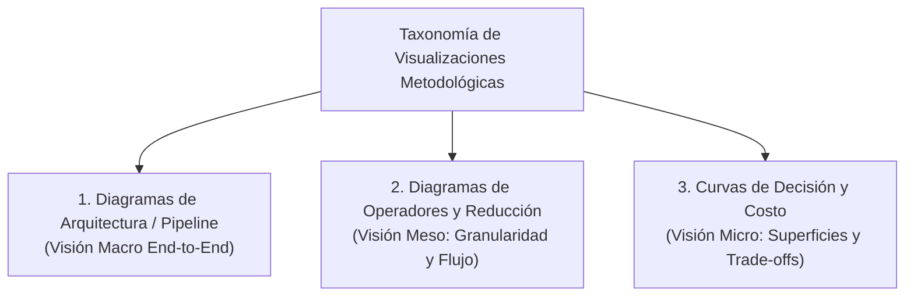

# Metodología Teórica: Diseño de Figuras y Diagramas en Inteligencia Artificial

Este documento formaliza el marco teórico, semiótico y metodológico para el diseño de representaciones visuales técnicas en proyectos de Inteligencia Artificial y Aprendizaje Automático, prescindiendo de cualquier referencia al caso de estudio particular o conjunto de datos específico.

---

## 1. Principio de Autosuficiencia Visual en Literatura Científica (IEEE / ACM)

En publicaciones académicas y técnicas rigurosas, toda figura debe satisfacer el **Principio de Autosuficiencia Hermenéutica**:
> *"Una figura técnica debe ser comprendida e interpretada en su totalidad por un revisor especializado sin necesidad de recurrir a la lectura del texto circundante en el cuerpo del manuscrito."*

Para alcanzar este estándar, una figura debe incorporar formalmente:
1. **Título y Etiquetado Canónico:** Numeración formal (`Figura N: ...`) y leyenda explícita que defina la totalidad de símbolos, abreviaciones, acrónimos y convenciones de codificación cromática.
2. **Pie de Figura Descriptivo (*Caption*):** Texto sintetizado de 3 a 5 líneas que establezca el objetivo del diagrama, el flujo direccional del proceso y la conclusión principal que el lector debe extraer.
3. **Desacoplamiento Tipográfico:** Textos internos legibles a escala final de impresión ($\ge 7\text{pt}$ para documentos a dos columnas), evitando mapas de bits pixelados y favoreciendo gráficos vectoriales (PDF / EPS / SVG).

---

## 2. Taxonomía de Diagramas Técnicos en Sistemas de Aprendizaje Automático

De acuerdo con las mejores prácticas en ingeniería de software para IA, las representaciones visuales de la metodología se dividen en tres clases funcionales:

### 2.1 Diagrama de Arquitectura del Pipeline (*End-to-End Pipeline Diagram*)
* **Propósito:** Sintetizar el grafo acíclico dirigido (DAG) de transformaciones que toma datos brutos heterogéneos y genera decisiones operativas.
* **Componentes Fundamentales:**
  * **Fuentes de Ingesta:** Delimitación de orígenes y granularidades de entrada.
  * **Capa de Ingeniería de Características:** Secuencia ordenada de operadores de limpieza, imputación y transformación.
  * **Barreras de Integridad:** Delimitación explícita de cortafuegos de aislamiento (*Data Leakage Barriers*).
  * **Capa de Aprendizaje Inductivo:** Modelos supervisados y función de optimización.
  * **Capa de Inferencia y Validación:** Mecanismos de decisión por umbral y protocolos de evaluación fuera de distribución.

### 2.2 Diagrama de Operadores y Reducción de Granularidad
* **Propósito:** Explicar visualmente mapeos relacionales no triviales de grano fino a grano grueso ($\Phi: \mathbb{R}^{m \times p} \to \mathbb{R}^k$), ilustrando cómo se resuelve la disparidad de cardinalidad (e.g., entidades anidadas $1:M$).
* **Estructura Típica:** Bifurcaciones en ramas de extracción determinista (agente líder) y ramas de funcionales estadísticos colectivos (agregación de conjunto).

### 2.3 Curvas de Trade-off Paramétrico y Costo Asimétrico
* **Propósito:** Graficar superficies de pérdida o curvas de costo operativo frente a hiperparámetros continuos (como el umbral de decisión $\tau \in [0, 1]$).
* **Estructura Típica:** Eje horizontal para el parámetro libre y dos ejes verticales que confrontan el costo global contra métricas de error Tipo I y Tipo II, identificando el mínimo funcional.

---

## 3. Semiótica Visual y Prevención de Sobrecarga Cognitiva

El diseño visual debe obedecer las leyes de la Gestalt para optimizar la velocidad de comprensión del evaluador:

1. **Codificación Cromática Funcional:**
   * Un color específico para contenedores de datos de entrada (e.g., tonos neutros o azules fríos).
   * Un color para operadores propios de transformación (e.g., tonos verdes o turquesas institucionales).
   * Un color de advertencia para barreras de fuga de datos o restricciones de integridad (e.g., rojo o naranja).
   * Un color destacado para el módulo de inducción del clasificador.
2. **Direccionalidad y Alineación:** Flujo estrictamente monótono de izquierda a derecha ($LR$) o de arriba hacia abajo ($TD$), minimizando cruces de aristas (*edge crossings*).
3. **Agrupamiento Modular (*Subgraphs*):** Encapsulamiento de etapas mediante recuadros etiquetados que representen capas de responsabilidad diferenciadas.
