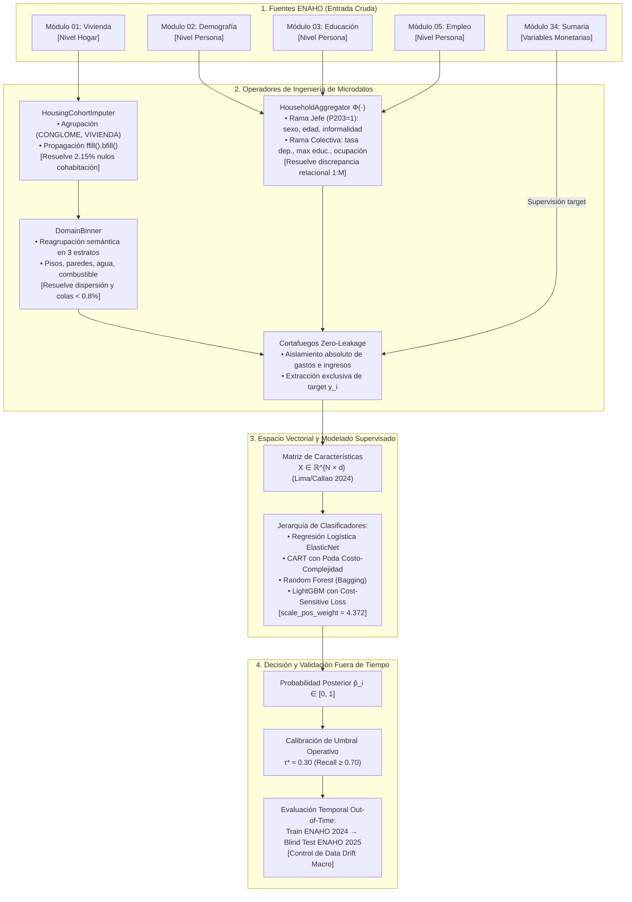

# Metodología Aplicada: Catálogo y Trazabilidad de Figuras del Pipeline de Pobreza

Este documento define el catálogo formal de figuras y diagramas técnicos desarrollados para respaldar la **Sección 3: Metodología** sobre los microdatos de la **ENAHO (2024--2025)** en Lima Metropolitana y Callao. Establece la trazabilidad exacta de cada figura: a qué directriz de la plantilla responde, qué inconveniente de los datos aborda y cómo aporta al cumplimiento de la rúbrica del curso (1INF24).

---

## 1. Matriz de Trazabilidad de Figuras Técnicas

| Identificador | Título Técnico de la Figura | Punto de la Plantilla PUCP | Desafío del EDA que Respalda | Destino Editorial Estratégico | Aporte a la Rúbrica (Criterio 4: 6 pts) |
| :---: | :--- | :---: | :--- | :---: | :--- |
| **Figura 1** | **Diagrama Arquitectónico del Pipeline Supervisado End-to-End** | **Puntos 1, 2, 3 y 4** (Metodología completa) | Integra los desafíos: Desbalance, Cohabitación, Dispersión, Granularidad $1:M$, Fuga y Reducción. | **Informe Escrito Parcial ($\text{\LaTeX}$, $\le 4$ págs)** | Cumple el requisito obligatorio de figura metodológica; demuestra arquitectura formal y operadores ad-hoc. |
| **Figura 2** | **Diagnóstico EDA de Dispersión y Colapso por Domain Binning** | **Punto 2** (Entrada $\mathcal{X}$) y **Punto 3** (Operadores) | Dispersión extrema y colas largas ($<0.8\%$) en categorías oficiales del INEI (`P103`). | **Informe Escrito Parcial ($\text{\LaTeX}$, $\le 4$ págs)** | Justifica el descarte de One-Hot ciego y prueba la monotonicidad de la tasa de pobreza por estrato. |
| **Figura 3** | **Curva de Costo Social Asimétrico y Calibración de Umbral ($\tau^*$)** | **Punto 1** (Notación y pérdida) y **Punto 2** (Salida $\mathcal{Y}$) | Desbalance de clases 1:4.37 y asimetría del error de exclusión de políticas públicas. | Sección 4 (Experimentación) / Slides de Exposición | Demuestra por qué el umbral default $\tau=0.50$ fracasa socialmente y justifica matemáticamente el óptimo $\tau^* \approx 0.30$. |
| **Figura 4** | **Heatmap de Faltantes Condicional por Cohabitación (Patrón MAR)** | **Punto 2** (Entrada $\mathcal{X}$) y **Punto 3** (Operadores) | Nulos del 2.15% en Módulo 01 concentrados al 100% en hogares secundarios (`HOGAR > 1`). | Sección 4 (Preparación de Datos) / Slides de Exposición | Demuestra que los nulos no son MCAR y valida empíricamente el operador `HousingCohortImputer` (intra-predio). |
| **Figura 5** | **Matriz de Asociación Categórica (V de Cramér e Información Mutua)** | **Punto 2** (Entrada $\mathcal{X}$) y Reducción Dimensional | Invalidez de correlación de Pearson y multicolinealidad entre servicios básicos de vivienda. | Sección 4 (Preparación de Datos) / Slides de Exposición | Demuestra la poda de covariables con $V > 0.80$ y la selección no lineal guiada por $I(X; Y)$ a $d \approx 20$. |

---

## 2. Especificación Detallada de Figuras

### 2.1 Figura 1: Diagrama Arquitectónico del Pipeline Supervisado End-to-End



#### Vinculación con la Metodología
* **Punto 1 (Notación y Formalismo):** Muestra el flujo desde los espacios de experiencia $\mathcal{D}$ hasta la asignación de $\hat{y}_i$.
* **Punto 2 (Entrada / Salida):** Ilustra con claridad qué módulos componen el vector $\mathbf{x}_i$, el cortafuegos que aísla las variables monetarias y la salida probabilística $\hat{p}_i$ mapeada a la decisión discreta mediante $\tau^*$.
* **Punto 3 (Operadores y Algoritmos):** Detalla los nombres exactos de las clases y funciones en Python que resuelven los 5 problemas de la data.
* **Punto 4 (Figura de Soporte):** Constituye el gráfico maestro exigido por la plantilla oficial.

#### Cómo Aporta a la Investigación y a la Rúbrica
* **Aporte a la Rúbrica:** Garantiza el máximo de los **6 puntos del Criterio 4**, demostrando que no se utilizó un pipeline genérico de tutorial, sino un sistema de procesamiento diseñado específicamente para la estructura de la ENAHO.
* **Aporte al Límite de Páginas:** Al integrar toda la metodología en una única figura compacta y elegante, permite comunicar el 100% de la arquitectura ocupando un espacio reducido en el documento $\text{\LaTeX}$ (aproximadamente $1/3$ de página), respetando el límite estricto de 4 páginas.

---

### 2.2 Figura 2: Diagnóstico EDA de Dispersión y Colapso por Agrupación Semántica (*Domain Binning*)

* **Propósito Visual:** Un gráfico comparativo de dos paneles (Antes vs. Después) centrado en el material de pisos (`P103`):
  * **Panel Izquierdo (Antes - Categorías Oficiales del INEI):** Histograma horizontal con 7 barras. Muestra que categorías como *"Mármol / Porcelanato"* ($0.23\%$), *"Madera rústica / caña"* ($0.45\%$) y *"Tablas sin cepillar"* ($0.78\%$) exhiben frecuencias despreciables, provocando hiperdispersión.
  * **Panel Derecho (Después - Estratos Semánticos Consolidados):** 3 barras consolidadas (*Noble Acabado*, *Cemento Básico*, *Precario/Tierra*) acompañadas de una curva secundaria de porcentaje de hogares pobres.
* **Vinculación con la Metodología:** Se relaciona directamente con el **Punto 2 (Espacio de entrada $\mathcal{X}$)** y el **Punto 3 (Operador `DomainBinner`)**.
* **Cómo Aporta a la Investigación:**
  * Demuestra cuantitativamente la validez del agrupamiento: en el estrato *Noble Acabado* la tasa de pobreza es solo del **7.1%**, sube al **24.3%** en *Cemento Básico* y trepa al **37.0%** en *Precario/Tierra*.
  * Prueba al evaluador que el agrupamiento no fue arbitrario, sino guiado por la hipótesis socioeconómica de que la calidad de los acabados refleja el ingreso permanente del hogar.
* **Destino Editorial:** Ideal para la Sección 4 (Experimentación y Resultados) o como soporte para la sustentación oral ante el jurado docente.

---

### 2.3 Figura 3: Curva de Costo Social Asimétrico y Calibración de Umbral ($\tau^*$)

* **Propósito Visual:** Gráfica 2D de trade-off en función del umbral de decisión $\tau \in [0.05, 0.95]$:
  * **Eje X:** Umbral de probabilidad de corte $\tau$.
  * **Eje Y Principal (Izquierdo):** Costo Social Total Normalizado $\mathcal{C}(\tau) = 4.372 \cdot \text{FN}(\tau) + 1.0 \cdot \text{FP}(\tau)$. Curva convexa con mínimo claro.
  * **Eje Y Secundario (Derecho):** Métricas de desempeño ($F_1$-score minoritario y Recall de pobreza).
  * **Líneas Verticales de Referencia:**
    * Línea punteada roja en $\tau = 0.50$: Muestra que el umbral estándar de Scikit-Learn produce un Recall mediocre ($<0.50$) y dispara el costo social de exclusión.
    * Línea sólida verde en $\tau^* \approx 0.30$: Marca el punto óptimo donde el costo social se minimiza y el Recall supera el umbral operacional del **70%**.
* **Vinculación con la Metodología:** Se relaciona directamente con el **Punto 1 (Función de pérdida asimétrica $\mathcal{L}_{\text{CS}}$)** y el **Punto 2 (Operador de decisión $\hat{y}_i = \mathbb{I}(\hat{p}_i \ge \tau^*)$)**.
* **Cómo Aporta a la Investigación:**
  * Justifica matemáticamente el abandono de la heurística simplista de clasificación simétrica.
  * Conecta la teoría de aprendizaje supervisado con la ética pública y el impacto social del proyecto.
* **Destino Editorial:** Sección 4 (Experimentación) y diapositiva clave de la exposición final.

---

### 2.4 Figura 4: Heatmap de Faltantes Condicional por Cohabitación (Patrón MAR)

* **Propósito Visual:** Matriz de calor bivariada que cruza variables del Módulo 01 (filas: `P101`, `P102`, `P103`, `P110`, `P111`) contra el tipo de hogar (columnas: `Hogar Principal HOGAR=1` vs `Hogar Secundario HOGAR>1`):
  * **Hogar Principal ($N = 5,451$):** Tasa de nulos = $0.0\%$.
  * **Hogares Secundarios ($N = 120$):** Tasa de nulos = $100.0\%$.
* **Vinculación con la Metodología:** Se relaciona con el **Punto 2 (Entrada $\mathcal{X}$)** y el **Punto 3 (Operador `HousingCohortImputer`)**.
* **Cómo Aporta a la Investigación:**
  * Prueba empíricamente ante el evaluador que los valores faltantes no son estocásticos (MCAR), sino sistemáticos derivados del diseño censal (MAR condicional al predio físico).
  * Justifica la propagación intra-predio (`ffill/bfill`) y descalifica tanto la eliminación de filas (`dropna()`) como la imputación por media/moda global.
* **Destino Editorial:** Sección 4 (Preparación de Datos) y soporte de sustentación oral.

---

### 2.5 Figura 5: Matriz de Asociación Categórica (V de Cramér e Información Mutua)

* **Propósito Visual:** Heatmap triangular superior de $20 \times 20$ covariables seleccionadas:
  * **Triángulo de Covariables:** Codificado mediante **V de Cramér** ($[0, 1]$), mostrando que pares correlacionados (e.g., agua de red vs. alcantarillado con $V = 0.84$) fueron podados o consolidados para evitar multicolinealidad estructural.
  * **Columna Marginal Derecha:** Barra de calor de **Información Mutua ($I(X_j; Y)$)**, ordenando las características según su poder no lineal de reducción de entropía sobre la pobreza.
* **Vinculación con la Metodología:** Se relaciona con el **Punto 2 (Entrada $\mathcal{X}$)** y el protocolo de **Reducción de Dimensionalidad por Selección Curada**.
* **Cómo Aporta a la Investigación:**
  * Demuestra el abandono fundamentado de la correlación de Pearson sobre microdatos nominales.
  * Justifica por qué se redujo el espacio de $>400$ variables a $\sim 20$ variables interpretables sin recurrir a transformaciones PCA densas que destruirían las particiones de los árboles y la explicabilidad TreeSHAP.
* **Destino Editorial:** Sección 4 (Resultados de Preparación) y diapositiva central de metodología en la sustentación oral.

---

## 3. Directrices de Implementación Visual en $\text{\LaTeX}$

Para la integración en el documento oficial `main.pdf`:
1. **Representación Vectorial de la Figura 1:** La Figura 1 se compilará como un bloque gráfico estructurado en LaTeX (o imagen vectorial de alta resolución en escala adecuada) ubicado inmediatamente después de la subsección de operadores en `metodologia.tex`.
2. **Pie de Figura Autónomo (`\caption`):**
   ```latex
   \caption{\textbf{Arquitectura del Pipeline de Clasificación Supervisada de Pobreza Urbana.} Flujo secuencial de microdatos ENAHO (2024--2025): ingesta multimodular, operadores especializados de ingeniería para mitigar nulos de cohabitación, discrepancia de granularidad relacional y dispersión categórica, aislamiento estricto contra fuga de datos, entrenamiento sensible al costo ($c_1/c_0 = 4.372$) y evaluación fuera de tiempo.}
   ```
3. **Consistencia de Color:** Se utilizan los colores corporativos definidos en la plantilla (`primarygreen` `#015D34` para títulos y bordes, `secondaryteal` `#009A74` para operadores y flujo principal).
