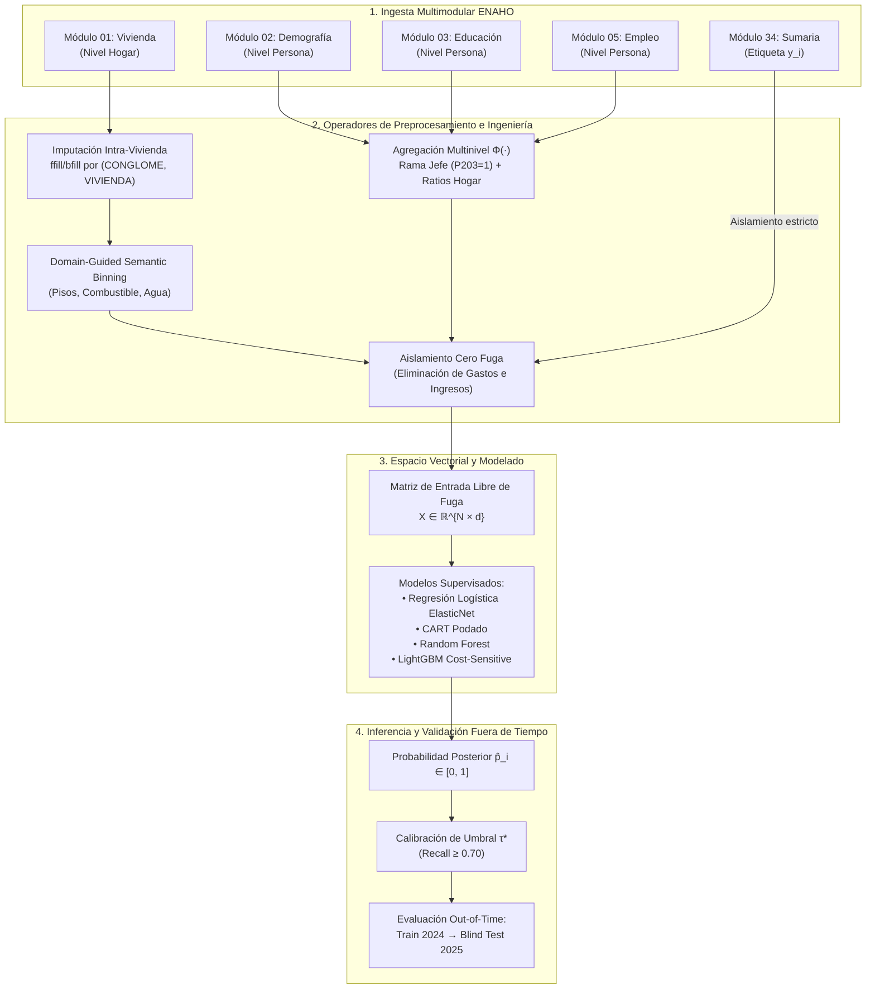

# Sección 3: Metodología

## 1. Desmitificación Empírica: ¿Por Qué la Pobreza No es un Árbol Simple de Materiales?

Durante la exploración inicial se planteó una interrogante crítica:  
*¿Podría este problema degenerar en un árbol de decisión trivial de 2 o 3 reglas (ejemplo: si la pared es de madera o estera, entonces el hogar es pobre)?*

Para responder rigurosamente, se evaluaron los **5,571 hogares de Lima Metropolitana y el Callao** (ENAHO 2024), contrastando las condiciones habitacionales contra la etiqueta oficial de pobreza monetaria de Sumaria (**18.61% pobres vs 81.39% no pobres**). La evidencia empírica desmintió de forma contundente cualquier regla trivial:

### Evidencia Empírica de los Datos:
1. **El 59.40% de los hogares pobres en Lima viven en casas con paredes de LADRILLO Y BLOQUE DE CEMENTO:**  
   De los 1,037 hogares pobres identificados, 616 habitan viviendas consolidadas de albañilería noble producto de décadas de autoconstrucción progresiva.
2. **El 65.03% de los hogares con paredes de MADERA NO SON POBRES:**  
   De 509 hogares con pared de madera, 331 tienen ingresos y consumo per cápita superiores a la línea de pobreza.
3. **El 70.18% de los hogares con paredes de ADOBE NO SON POBRES:**  
   De 560 hogares con adobe, 393 pertenecen al estrato no pobre.
4. **El 79.46% de los hogares pobres tienen PISO DE CEMENTO O LOSETA:**  
   Solo una minoría de los pobres urbanos habita sobre pisos de tierra pura.

**Conclusión Metodológica:** Ningún clasificador basado exclusivamente en el Módulo de Vivienda (01) puede resolver el problema. Se requiere obligatoriamente capturar las **interacciones no lineales entre Vivienda (Módulo 01), Demografía y Dependencia (Módulo 02), Capital Humano (Módulo 03) e Informalidad Laboral (Módulo 05)**.

---

## 2. Formalización Matemática del Problema (Framework de Aprendizaje Supervisado)

Siguiendo la formalización canónica de Tom Mitchell (1997) establecida en el curso de Inteligencia Artificial (1INF24):

* **Tarea ($T$):** Clasificación binaria que asigna a cada hogar $i$ una etiqueta $\hat{y}_i \in \{0, 1\}$, donde:
  $$y_i = \begin{cases} 1 & \text{si el hogar está en Pobreza Total (Extrema o No Extrema)} \\ 0 & \text{si el hogar es No Pobre} \end{cases}$$
* **Experiencia ($E$):** Muestra de microdatos multi-anual etiquetada $\mathcal{D}_{\text{train}} = \{(\mathbf{x}_i, y_i)\}_{i=1}^N$, donde cada vector $\mathbf{x}_i \in \mathcal{X} \subset \mathbb{R}^d$ sintetiza atributos habitacionales, demográficos y laborales provenientes de la ENAHO 2024 ($N = 5,571$), evaluada posteriormente de forma ciega en la ENAHO 2025 ($\mathcal{D}_{\text{test}}$).
* **Medida de Desempeño ($P$):**
  * $F_1$-score de la clase minoritaria (media armónica entre Precision y Recall).
  * Área bajo la curva Precision-Recall (PR-AUC).
  * Sensibilidad / Recall de la clase pobre ($1 - \text{Tasa de Error de Exclusión}$), con meta operativa $\ge 0.70$.
  * Brier Score (para evaluar calibración probabilística).

### Función de Pérdida Sensible al Costo (*Cost-Sensitive Loss*)
Dado que el error de exclusión social (dejar sin subsidio a un hogar pobre, Falso Negativo) tiene un costo social severo frente al error de inclusión (Falso Positivo), se parametriza una función de pérdida logística asimétrica:
$$\mathcal{L}_{\text{CS}}(\theta) = -\frac{1}{N} \sum_{i=1}^N \left[ c_1 y_i \log(\hat{p}_i) + c_0 (1 - y_i) \log(1 - \hat{p}_i) \right] + \lambda \Omega(\theta)$$
donde la razón de costos refleja el desbalance empírico de clases en Lima:
$$\frac{c_1}{c_0} = \frac{4,534}{1,037} \approx 4.372$$
garantizando que el gradiente penalice fuertemente la omisión de familias en pobreza.

---

## 3. Comportamiento Entrada / Salida

* **Espacio de Entrada ($\mathcal{X}$):** Vector multidimensional $\mathbf{x}_i = [\mathbf{x}_i^{(\text{viv})}, \mathbf{x}_i^{(\text{dem})}, \mathbf{x}_i^{(\text{educ})}, \mathbf{x}_i^{(\text{emp})}]^T \in \mathbb{R}^d$ a nivel de hogar `(CONGLOME, VIVIENDA, HOGAR)`:
  1. *Vivienda (Módulo 01):* Calidad de piso, pared, techo, tipo de vivienda, abastecimiento de agua, saneamiento, combustible de cocina, tenencia jurídica (título), total de dormitorios, índice de hacinamiento, internet, telefonía.
  2. *Demografía (Módulo 02):* Tamaño del hogar, número de niños menores de 5 años, adultos mayores, tasa de dependencia demográfica, sexo y edad del jefe de hogar.
  3. *Educación (Módulo 03):* Años de educación formal del jefe de hogar, máximo nivel educativo en la familia, asistencia escolar de menores.
  4. *Empleo e Informalidad (Módulo 05):* Condición de actividad del jefe (ocupado/desocupado/inactivo), condición de informalidad (empleo sin RUC ni derechos), afiliación a pensión (AFP/ONP), horas semanales trabajadas, tasa de ocupación familiar.

* **Política de Cero Fuga de Datos (*Zero Data Leakage*):** Se excluyen matemáticamente del espacio $\mathcal{X}$ los ingresos (`INGHOG2D`), gastos (`GASHOG2D`) y líneas de pobreza de Sumaria, los cuales únicamente operan para definir el *target* $y_i$.

* **Espacio de Salida ($\mathcal{Y}$):** Probabilidad posterior estimada $\hat{p}_i = P(y_i = 1 \mid \mathbf{x}_i) \in [0, 1]$ y clasificación binaria discreta $\hat{y}_i = \mathbb{I}(\hat{p}_i \ge \tau^*)$, donde el umbral $\tau^*$ se calibra operativamente para maximizar el $F_1$-score sujeto a $\text{Recall} \ge 0.70$.

---

## 4. Desafíos Prácticos de los Microdatos (Hallazgos del EDA Inicial) y Estrategias de Mitigación

El Análisis Exploratorio de Datos (EDA) inicial sobre los microdatos de la ENAHO 2024 reveló 5 fricciones empíricas críticas que justifican el diseño de operadores ad-hoc:

| Desafío Empírico en ENAHO | Hallazgo Cuantitativo del EDA Inicial | Riesgo Metodológico | Estrategia de Mitigación en el Pipeline |
| :--- | :--- | :--- | :--- |
| **1. Desbalance de Clases Severo** | Solo 18.61% de hogares en pobreza vs 81.39% no pobres (ratio 1:4.37). | Paradoja de Exactitud: predecir siempre clase 0 da 81.4% *accuracy* pero 100% de exclusión social. | Función *Cost-Sensitive Loss* ($c_1/c_0 = 4.372$), calibración de umbral $\tau^* \approx 0.30$ y optimización de $F_1$/PR-AUC. |
| **2. Nulos Estructurales en Vivienda** | 2.15% de hogares (120 familias secundarias `HOGAR 22, 33...`) con 100% nulos en Módulo 01. | Pérdida de hogares vulnerables si se aplica `dropna()` o distorsión si se imputa media global. | Diagnóstico con Heatmap de Faltantes Condicional; operador `HousingCohortImputer` (`ffill/bfill`) por `(CONGLOME, VIVIENDA)`. |
| **3. Dispersión y Colas Largas (*Sparsity*)** | Categorías como mármol, caña o carbón con frecuencias menores al 0.8% en pisos y paredes. | *One-Hot Encoding* crearía matrices hiperdispersas ($>40$ variables irrelevantes) y sobreajuste. | Operador `DomainBinner`: agrupación semántica en 3 niveles ordenados guiados por tasas empíricas de pobreza. |
| **4. Granularidad Relacional ($1:M$)** | Módulo 01 a nivel de hogar, pero Módulos 02, 03 y 05 con 19,420 personas ($1$ a $12$ por familia). | Imposibilidad de unión tabular directa y pérdida de dinámicas de dependencia intrafamiliar. | Operador `HouseholdAggregator` $\Phi(\cdot)$: bifurcación entre decisor principal ($P203=1$) y métricas del núcleo colectivo. |
| **5. Redundancia e Invalidez de Pearson** | Predominio de variables nominales/ordinales; Pearson ($r$) introduce distancias espurias. | Multicolinealidad oculta entre servicios y categorías redundantes no detectables con álgebra lineal clásica. | Matriz de V de Cramér ($V \in [0, 1]$) entre pares de covariables e Información Mutua ($I(X; Y)$) frente al target. |
| **6. Fuga de Información y Alta Dimensión** | >400 columnas crudas; gastos e ingresos monetarios correlacionados en $>0.85$ con el target. | Sobreajuste y pérdida de aplicabilidad operativa en campo de focalización. | Reducción de Dimensionalidad por Selección Curada (Cortafuegos $\to$ Poda Cramér $\to$ Ranking $I(X; Y)$) a $d \approx 20$. |

---

## 5. Análisis de Asociación Categórica y Reducción de Dimensionalidad

### 5.1 Invalidez de la Correlación de Pearson y Métricas Adecuadas
El cálculo de correlación de Pearson sobre microdatos categóricos es matemáticamente inválido porque asume variables continuas y relaciones lineales con espaciamiento métrico uniforme. Para el análisis exploratorio y la selección de variables se formula un esquema formal de dos niveles:
1. **Asociación Categórica entre Covariables (V de Cramér):**  
   Para detectar multicolinealidad entre atributos nominales (e.g., tipo de abastecimiento de agua vs. red de desagüe), se calcula:
   $$V(X_j, X_k) = \sqrt{\frac{\chi^2}{N \cdot \min(r - 1, c - 1)}} \quad \in [0, 1]$$
   Pares con $V > 0.80$ indican redundancia estructural extrema, justificando la eliminación o consolidación de una de las variables.
2. **Capacidad Predictiva No Lineal frente al Target (Información Mutua):**  
   Para evaluar el poder discriminante de cada característica continua o discreta respecto al target $Y \in \{0, 1\}$, se computa:
   $$I(X_j; Y) = \sum_{x \in \mathcal{X}_j} \sum_{y \in \{0, 1\}} p(x, y) \log \left( \frac{p(x, y)}{p(x)p(y)} \right)$$
   Mide la reducción de incertidumbre (entropía) sobre la pobreza sin asumir relaciones monótonas ni distribuciones normales.

### 5.2 Reducción de Dimensionalidad: Selección Curada vs. Proyección PCA/FAMD
Se evaluó el uso de técnicas de proyección factorial ortogonal como PCA o FAMD (*Factor Analysis of Mixed Data*). No obstante, la reducción a 2 o 3 componentes densos fue **deliberadamente descartada** por dos razones de ingeniería y ética:
1. **Degradación de Algoritmos Arbóreos:** Los ensambles de árboles (Random Forest y LightGBM) dividen el espacio mediante particiones ortogonales alineadas a los ejes sobre variables directas (*"¿tiene abastecimiento por red pública?"*). Rotar el espacio mediante combinaciones lineales diluye las señales binarias discretas en dimensiones continuas abstractas, deteriorando la capacidad inductiva de los árboles.
2. **Explicabilidad Pública y Cumplimiento Ético:** En la asignación de transferencias estatales y focalización del SISFOH, un clasificador debe proporcionar explicabilidad univariada exacta mediante valores Shapley (TreeSHAP). Proyectar sobre componentes latentes abstractos imposibilita justificar a una familia o auditor por qué fue o no clasificada como pobre.

Por tanto, la **Reducción de Dimensionalidad** se implementa como un proceso riguroso de **Selección y Curaduría de Características (*Feature Selection*) en tres etapas**, reduciendo el espacio de más de 400 variables originales del INEI a un vector compacto y no redundante de $d \approx 20$ dimensiones físicas interpretables:
* **Etapa 1 (Cortafuegos Ético):** Exclusión de todas las variables monetarias de gasto e ingreso del Módulo 34.
* **Etapa 2 (Poda de Redundancia por V de Cramér):** Eliminación de covariables con asociación redundante ($V > 0.80$).
* **Etapa 3 (Filtro por Información Mutua):** Selección de las características con mayor reducción de entropía condicional $I(X_j; Y)$.

---

## 5. Operadores y Adaptaciones Algorítmicas Desarrolladas

### 1. Imputación Intra-Vivienda por Cohabitación Multifamiliar (`HousingCohortImputer`)
En la ENAHO, el 2.15% de los hogares en Lima corresponden a hogares secundarios (`HOGAR 22, 33...`) que alquilan cuartos o comparten la vivienda física con el hogar principal (`HOGAR 11`). Para estos hogares secundarios, el encuestador del INEI deja vacías las preguntas de materiales físicos de la vivienda.
* **Operador:** Propagación agrupada por clave física `(CONGLOME, VIVIENDA)` mediante forward-fill y backward-fill (`ffill().bfill()`), resolviendo el 100% de los nulos estructurales sin imputar valores sintéticos artificiales.

### 2. Agregación Multinivel ($\text{Individuo} \to \text{Hogar}$) (`HouseholdAggregator`)
Los módulos 02, 03 y 05 vienen a nivel de persona (`CODPERSO`). Para llevarlos a nivel de hogar, se implementó un operador dual $\Phi(\cdot)$:
* **Rama Jefe de Hogar ($P203 = 1$):** Extrae directamente los atributos del decisor principal del hogar (sexo, edad, nivel educativo, informalidad laboral, pensión).
* **Rama Núcleo del Hogar:** Aplica funciones de agregación estadística:
  $$\text{tamano\_hogar} = \sum \mathbb{I}(\text{persona}), \quad \text{tasa\_dependencia} = \frac{\sum \mathbb{I}(\text{edad} < 15 \lor \text{edad} \ge 65)}{\max(1, \sum \mathbb{I}(15 \le \text{edad} \le 64))}$$
  $$\text{max\_educ\_hogar} = \max_{j} (\text{nivel\_educ}_j), \quad \text{tasa\_ocupacion} = \frac{\sum \mathbb{I}(\text{ocupado}_j)}{\max(1, \sum \mathbb{I}(\text{edad}_j \ge 14))}$$

### 3. Agrupación Semántica Guiada por Dominio (*Domain-based Binning*)
Para evitar la dispersión de *One-Hot Encoding* sobre categorías con colas inferiores al 1%, se reagruparon las categorías por afinidad socioeconómica:
* `piso_calidad`: `noble_acabado` (7.1% pobreza) vs `cemento_basico` (24.3% pobreza) vs `precario_tierra` (37.0% pobreza).
* `combustible_tipo`: `gas_glp` vs `gas_natural_electricidad` vs `biomasa_precaria` (36.5% pobreza).
* `agua_acceso`: `red_publica` (87.4%) vs `fuente_vulnerable` (26.8% pobreza).

### 4. Adaptación de la Jerarquía de Modelos del Curso
1. **Regresión Logística ElasticNet:** Baseline lineal paramétrico con ponderación de clases $c_1/c_0 = 4.372$ y balance $L_1/L_2$.
2. **Árbol de Decisión CART:** Modelo no lineal ortogonal con divisiones ponderadas por costo y poda por complejidad ($\alpha = 0.002$).
3. **Random Forest Classifier:** Ensamble por bagging con subsampling estratificado y reducción de varianza.
4. **LightGBM Classifier:** Ensamble por boosting secuencial con `scale_pos_weight = 4.372`, optimización por hojas (*leaf-wise*) y regularización de hessianos.

---

## 6. Diagrama de Arquitectura del Pipeline

